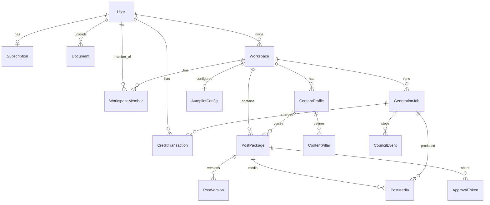

# Database Schema Reference

> **Source of truth:** `apps/backend/prisma/schema.prisma`  
> **Companion docs:** [CURRENT_ARCHITECTURE.md](CURRENT_ARCHITECTURE.md) · [PRODUCT_OVERVIEW.md](PRODUCT_OVERVIEW.md)  
> **Last synced:** June 2026 (notifications slice + schema cleanup phases 1–3)

Developer reference for every PostgreSQL table, field, enum, and relationship. Read this before writing Prisma queries, migrations, or API mappers.

---

## Conventions

| Convention | Detail |
|------------|--------|
| **IDs** | UUID v4 (`@db.Uuid`), generated by Postgres/Prisma |
| **Timestamps** | `timestamptz(6)` — always UTC in app logic |
| **Soft delete** | `deletedAt` set instead of hard delete on some models; queries use `NOT_DELETED` (`deletedAt: null`) from `apps/backend/src/common/constants/soft-delete.constants.ts` |
| **Tenancy** | Content is **workspace-scoped** (`workspaceId`). Credits are **user-scoped** (`userId`) |
| **Table names** | Snake_case in Postgres; Prisma models are PascalCase with `@@map` |
| **LinkedIn OAuth** | Tokens live in **Clerk**, not in this DB. `User.linkedInProfile` is a cached snapshot |

### Entity hierarchy

```
User
 └── Workspace (personal | client)
      ├── ContentProfile → ContentPillar[]
      ├── PostPackage (central workflow entity)
      ├── GenerationJob (includes council execution)
      └── AutopilotConfig
```

---

## Enums

### `DocumentStatus`

| Value | Meaning |
|-------|---------|
| `pending` | Upload initiated; file may not be in R2 yet. Expires via `uploadExpiresAt` |
| `attached` | Upload confirmed and linked (profile via `User.profileDocumentId`) |

### `DocumentPurpose`

| Value | Meaning |
|-------|---------|
| `profile` | Profile avatar image. Bucket/size limits in `document.constants.ts`. Sets `User.profileDocumentId` on attach |

### `WorkspaceMemberRole`

| Value | Meaning |
|-------|---------|
| `owner` | Full access (default; only value used in production today) |
| `editor` | Reserved for future collaboration |
| `viewer` | Reserved for future collaboration |

### `UserPlan`

| Value | Credits/mo | Notes |
|-------|------------|-------|
| `free` | 5 | Default on signup |
| `starter` | 50 | Stripe-paid |
| `pro` | 200 | Autopilot, 30-day calendar |
| `agency` | 1000 | Client workspaces, approval share links |

Denormalized on `User.plan`, synced from Stripe via `BillingSyncService`. Feature gates in `plan-features.constants.ts`.

### `WorkspaceType`

| Value | Meaning |
|-------|---------|
| `personal` | One per user, auto-created on signup (partial unique index enforces one active personal workspace per owner) |
| `client` | Agency client workspace (max 5 per agency user). Soft-deletable |

### `ContentGoal`

| Value | Meaning |
|-------|---------|
| `build_authority` | Default. Fed into LLM prompts |
| `generate_leads` | |
| `grow_audience` | |

### `PostPackageStatus`

Pipeline state machine. Transition rules split across `post-status.transitions.ts`, `council-status.transitions.ts`, `scheduling-status.transitions.ts`, `publish-status.transitions.ts`.

| Value | Meaning | Typically set by |
|-------|---------|------------------|
| `draft` | Manual draft, editable | Posts CRUD |
| `text_generating` | Council job queued/running (writer) | `CouncilJobService` |
| `text_reviewing` | Writer done; reviewer/editor loop | `CouncilOrchestrator` |
| `media_generating` | Text approved; generating quote card | `CouncilOrchestrator` |
| `ready_for_approval` | Council complete; awaiting human | `CouncilOrchestrator` |
| `approved` | Human approved | Approvals API / share links |
| `scheduled` | `scheduledAt` set | Scheduling API |
| `publishing` | LinkedIn publish in flight | `LinkedInPublishService` |
| `published` | Live on LinkedIn | Publish success |
| `failed` | Council or publish failed | Orchestrator / publish error |

### `PostSource`

| Value | Meaning |
|-------|---------|
| `manual` | User-created draft (default) |
| `generation` | Council from Generate screen |
| `calendar` | Bulk calendar generation job |
| `autopilot` | Autopilot cron dispatch |

Affects credit type on charge (`council` vs `autopilot`) and dashboard filters.

### `PostType`

LLM / UI taxonomy for post format.

| Value |
|-------|
| `personal_story` |
| `list_post` |
| `how_to` |
| `contrarian_take` |
| `hot_take` |
| `case_study` |

### `CreditTransactionType`

| Value | Used in code? | Meaning |
|-------|---------------|---------|
| `generation` | Yes | Quick draft (1 credit) |
| `council` | Yes | AI Council (3 credits) |
| `calendar` | Yes | Bulk calendar (10 or 30) |
| `autopilot` | Yes | Autopilot package (10) |
| `media` | Yes | Media regen during council (5 credits per regen) |
| `adjustment` | Yes | Admin grants / billing corrections via `CreditsService.grant()` |

Ledger: negative `amount` = consumption. Balance = sum of negative amounts in current credit period vs plan limit.

### `GenerationJobStatus`

| Value | Meaning |
|-------|---------|
| `pending` | Enqueued, not started |
| `running` | Worker processing |
| `completed` | Success |
| `failed` | Error; see `errorCode` / `errorMessage` |

Council jobs use this status exclusively (no separate run status).

### `GenerationJobType`

| Value | Sync/async | Creates PostPackage? |
|-------|------------|----------------------|
| `quick_draft` | Sync | No |
| `council` | Async (BullMQ) | Yes |
| `calendar` | Async | Yes (many) |
| `media` | Async | No (existing draft) |

### `PostMediaType`

| Value | Meaning |
|-------|---------|
| `quote_card` | Only type today. Nano Banana 2 image |

### `CouncilAgentRole`

| Value | Pipeline step |
|-------|---------------|
| `writer` | First draft from brief/topic |
| `reviewer` | Scores draft; may trigger revision |
| `editor` | Polishes copy after reviewer pass |
| `media_creator` | Image spec + generation |
| `media_reviewer` | Scores media; may trigger regen |

### `CouncilEventStatus`

| Value | Meaning |
|-------|---------|
| `running` | Step in progress |
| `completed` | Step finished with output |
| `failed` | Step error |

### `SubscriptionStatus`

Mirrors Stripe subscription status. Synced in `BillingSyncService`.

| Value | Typical effect |
|-------|----------------|
| `active` | Paid plan applied |
| `trialing` | Paid plan during trial |
| `past_due` | Grace period — still treated as paid for credits |
| `canceled` | Reverts toward `free` |
| `incomplete` | Checkout started, not completed (default) |
| `unpaid` | Stripe unpaid state |

### `StripeWebhookEventStatus`

| Value | Meaning |
|-------|---------|
| `pending` | Inserted, handler not yet finished |
| `processed` | Handler succeeded |
| `failed` | Handler failed; Stripe replay will retry dispatch |

### `NotificationType`

| Value | Trigger |
|-------|---------|
| `generation_complete` | Async generation job finished |
| `post_ready_for_approval` | Council sets post to approval queue |
| `client_approved` | Public approval link approve |
| `client_requested_changes` | Public approval link request changes |
| `publish_succeeded` | LinkedIn publish worker success |
| `publish_failed` | LinkedIn publish worker failure |
| `weekly_content_reminder` | Monday 9am user timezone cron |
| `product_update` | Admin broadcast (future) |

### `NotificationDeliveryChannel`

`email` | `push`

### `NotificationDeliveryStatus`

`pending` | `sent` | `failed`

### `PushDevicePlatform`

`web` (v1)

---

## Tables

### `users` → `User`

Account identity. Synced from Clerk on sign-in/webhook.

| Field | Type | Null | Default | Description |
|-------|------|------|---------|-------------|
| `id` | UUID | No | uuid() | Internal primary key. Used in all FKs |
| `clerkId` | String | No | — | Clerk user ID. **Unique.** JWT `sub` maps here |
| `email` | String | No | — | **Unique.** From Clerk |
| `firstName` | String | Yes | — | Display name |
| `lastName` | String | Yes | — | Display name |
| `profileDocumentId` | UUID | Yes | — | **Unique.** FK → `documents.id`. Avatar from R2 |
| `profileImageUrl` | String | Yes | — | Public URL (may duplicate document URL) |
| `timezone` | String | No | `America/New_York` | Used for scheduling/autopilot. `PATCH /auth/me` |
| `emailWeeklyReminders` | Boolean | No | `true` | Email pref for weekly cron reminders |
| `emailGenerationComplete` | Boolean | No | `true` | Email pref for generation/approval-ready events |
| `emailProductUpdates` | Boolean | No | `false` | Email pref for product broadcasts |
| `emailPublishAlerts` | Boolean | No | `true` | Email pref for publish success/failure |
| `pushEnabled` | Boolean | No | `true` | Master web push toggle (`PATCH /auth/me`) |
| `plan` | UserPlan | No | `free` | **Denormalized** from Stripe. Credit limit source |
| `linkedInMemberId` | String | Yes | — | LinkedIn member URN/id for publish API |
| `linkedInProfileSyncedAt` | Timestamptz | Yes | — | Last profile sync timestamp |
| `linkedInProfile` | JSON | Yes | — | Cached OIDC profile (name, photo, etc.) |
| `createdAt` | Timestamptz | No | now() | |
| `updatedAt` | Timestamptz | No | auto | |
| `deletedAt` | Timestamptz | Yes | — | Soft delete on account removal |

**Relations:** `profileDocument`, `documents[]`, `ownedWorkspaces[]`, `workspaceMemberships[]`, `creditTransactions[]`, `generationJobs[]`, `subscription?`, `createdApprovalTokens[]`, `notifications[]`, `pushDeviceTokens[]`

**Module:** `users`, `auth`

---

### `subscriptions` → `Subscription`

One row per user (1:1). Stripe billing mirror.

| Field | Type | Null | Default | Description |
|-------|------|------|---------|-------------|
| `id` | UUID | No | uuid() | |
| `userId` | UUID | No | — | **Unique.** FK → `users.id` CASCADE |
| `stripeCustomerId` | String | No | — | **Unique.** Stripe customer |
| `stripeSubscriptionId` | String | Yes | — | **Unique.** Active subscription id |
| `stripePriceId` | String | Yes | — | Maps to `UserPlan` via `stripe-plan.map.ts` |
| `status` | SubscriptionStatus | No | `incomplete` | Stripe status |
| `cancelAtPeriodEnd` | Boolean | No | `false` | User canceled but still active until period end |
| `currentPeriodStart` | Timestamptz | Yes | — | Billing period start — drives credit period for paid users |
| `currentPeriodEnd` | Timestamptz | Yes | — | Billing period end |
| `createdAt` | Timestamptz | No | now() | |
| `updatedAt` | Timestamptz | No | auto | |

**Module:** `billing`

---

### `stripe_webhook_events` → `StripeWebhookEvent`

Idempotency log for Stripe webhooks.

| Field | Type | Null | Default | Description |
|-------|------|------|---------|-------------|
| `id` | String | No | — | Stripe event id (not UUID) |
| `type` | String | No | — | Event type e.g. `checkout.session.completed` |
| `status` | StripeWebhookEventStatus | No | `processed` | `pending` → dispatch → `processed` or `failed` |
| `errorMessage` | String | Yes | — | Last handler error when `status=failed` |
| `processedAt` | Timestamptz | No | now() | When row was last updated |

No relations. Prevents double-processing; failed rows are retried on Stripe replay.

---

### `documents` → `Document`

R2 object metadata for user uploads (presigned URL flow). Profile images only.

| Field | Type | Null | Default | Description |
|-------|------|------|---------|-------------|
| `id` | UUID | No | uuid() | |
| `userId` | UUID | No | — | FK → `users.id` CASCADE |
| `status` | DocumentStatus | No | `pending` | Lifecycle: pending → attached |
| `filename` | String | No | — | Original client filename |
| `mimeType` | String | No | — | Validated against purpose allowlist |
| `sizeBytes` | BigInt | No | — | Validated against purpose max size |
| `storageKey` | String | No | — | R2 object key |
| `storageBucket` | String | No | — | R2 bucket name from config |
| `purpose` | DocumentPurpose | No | — | `profile` only |
| `uploadExpiresAt` | Timestamptz | No | — | Pending upload must complete before this |
| `attachedAt` | Timestamptz | Yes | — | When attach confirmed |
| `createdAt` | Timestamptz | No | now() | |
| `updatedAt` | Timestamptz | No | auto | |

**Indexes:** `userId`, `(status, createdAt)`

**Flow:** `POST /documents/init` → client uploads to R2 → attach sets `User.profileDocumentId`.

**Module:** `documents`, `storage`

---

### `workspaces` → `Workspace`

Content container. All posts and profiles belong to a workspace.

| Field | Type | Null | Default | Description |
|-------|------|------|---------|-------------|
| `id` | UUID | No | uuid() | Used in all workspace-scoped API paths |
| `name` | String | No | — | Display name ("My Workspace" or client name) |
| `type` | WorkspaceType | No | `personal` | `personal` or `client` |
| `ownerId` | UUID | No | — | FK → `users.id` CASCADE. Billing user / LinkedIn publisher |
| `createdAt` | Timestamptz | No | now() | |
| `updatedAt` | Timestamptz | No | auto | |
| `deletedAt` | Timestamptz | Yes | — | Soft delete; cascades to child rows |

**Indexes:** `ownerId`, `(ownerId, type, deletedAt)`, partial unique `workspaces_one_personal_per_owner` on `(owner_id) WHERE type = 'personal' AND deleted_at IS NULL`

**Rules:** One active `personal` workspace per user. Max 5 `client` workspaces for agency plan. `ensurePersonalWorkspace()` on signup handles race via unique violation re-fetch.

**Module:** `workspaces`

---

### `workspace_members` → `WorkspaceMember`

Join table: which users can access which workspaces.

| Field | Type | Null | Default | Description |
|-------|------|------|---------|-------------|
| `workspaceId` | UUID | No | — | PK part. FK → `workspaces.id` CASCADE |
| `userId` | UUID | No | — | PK part. FK → `users.id` CASCADE |
| `role` | WorkspaceMemberRole | No | `owner` | Typed enum |

**Composite PK:** `(workspaceId, userId)`

**Access check:** `WorkspacesService.assertMember(userId, workspaceId)`

---

### `content_profiles` → `ContentProfile`

Voice and strategy input for AI generation. Multiple per workspace; one may be `isDefault`.

| Field | Type | Null | Default | Description |
|-------|------|------|---------|-------------|
| `id` | UUID | No | uuid() | |
| `workspaceId` | UUID | No | — | FK → `workspaces.id` CASCADE |
| `name` | String | No | — | Label e.g. "Founder voice" |
| `roleTitle` | String | Yes | — | Job title for prompts |
| `industry` | String | Yes | — | |
| `targetAudience` | String | Yes | — | ICP description |
| `contentGoal` | ContentGoal | No | `build_authority` | |
| `preferredTone` | String | Yes | — | Free text tone |
| `offerDescription` | String | Yes | — | Product/offer context |
| `writingSample` | Text | Yes | — | Example post for style matching |
| `avoidWords` | String | Yes | — | Comma-separated or free text |
| `isDefault` | Boolean | No | `false` | Used when generation omits `contentProfileId` |
| `createdAt` | Timestamptz | No | now() | |
| `updatedAt` | Timestamptz | No | auto | |
| `deletedAt` | Timestamptz | Yes | — | Soft delete |

**Indexes:** `workspaceId`, `(workspaceId, deletedAt)`

**Module:** `content-profiles`, `generation` (context provider)

---

### `content_pillars` → `ContentPillar`

Named themes under a content profile. Autopilot rotates through pillars.

| Field | Type | Null | Default | Description |
|-------|------|------|---------|-------------|
| `id` | UUID | No | uuid() | |
| `contentProfileId` | UUID | No | — | FK → `content_profiles.id` CASCADE |
| `name` | String | No | — | **Unique per profile** with `contentProfileId` |
| `sortOrder` | Int | No | `0` | Display / rotation order |

**Note:** `PostPackage.pillar` stores a **string copy** at generation time, not FK to this table.

---

### `post_packages` → `PostPackage`

**Central entity.** One LinkedIn post through its full lifecycle.

| Field | Type | Null | Default | Description |
|-------|------|------|---------|-------------|
| `id` | UUID | No | uuid() | |
| `workspaceId` | UUID | No | — | FK → `workspaces.id` CASCADE |
| `contentProfileId` | UUID | Yes | — | FK → `content_profiles.id` SET NULL. Voice used for generation |
| `hook` | String | No | — | Opening line (required even during generation placeholder) |
| `body` | Text | Yes | — | Main post body |
| `cta` | String | Yes | — | Call to action |
| `tags` | String[] | No | `[]` | Hashtags |
| `topic` | String | Yes | — | Generation input / display |
| `postType` | PostType | Yes | — | Format enum |
| `tone` | String | Yes | — | Generation input (free text) |
| `pillar` | String | Yes | — | Pillar **name** snapshot (not FK) |
| `source` | PostSource | No | `manual` | Origin of post |
| `status` | PostPackageStatus | No | `draft` | Pipeline state |
| `score` | Int | Yes | — | 0–100 council reviewer score. Shown in approvals |
| `scheduledAt` | Timestamptz | Yes | — | When to publish. **Calendar uses this field** (no separate calendar table) |
| `publishedAt` | Timestamptz | Yes | — | When successfully published |
| `linkedInPostId` | String | Yes | — | LinkedIn API post id |
| `linkedInPostUrl` | String | Yes | — | Public URL after publish |
| `publishErrorCode` | String | Yes | — | Machine code on failure |
| `publishErrorMessage` | Text | Yes | — | Human/debug error |
| `publishAttemptedAt` | Timestamptz | Yes | — | Last publish attempt |
| `submittedForApprovalAt` | Timestamptz | Yes | — | When moved to approval queue |
| `approvalFeedback` | Text | Yes | — | Client "request changes" notes |
| `createdAt` | Timestamptz | No | now() | |
| `updatedAt` | Timestamptz | No | auto | |
| `deletedAt` | Timestamptz | Yes | — | Soft delete (individual delete sets `deletedAt`) |

**Indexes:** `workspaceId`, `(workspaceId, status)`, `(workspaceId, updatedAt)`, `(workspaceId, scheduledAt)`, `(workspaceId, deletedAt)`

**Relations:** `versions[]`, `generationJobs[]`, `media[]`, `approvalTokens[]`

**Module:** `posts`, `calendar`, `approvals`, `scheduling`, `linkedin`, `council`

---

### `post_versions` → `PostVersion`

Immutable content snapshots when copy changes.

| Field | Type | Null | Default | Description |
|-------|------|------|---------|-------------|
| `id` | UUID | No | uuid() | |
| `postPackageId` | UUID | No | — | FK → `post_packages.id` CASCADE |
| `versionNumber` | Int | No | — | **Unique per post.** 1-based increment |
| `hook` | String | Yes | — | Snapshot |
| `body` | Text | Yes | — | Snapshot |
| `cta` | String | Yes | — | Snapshot |
| `tags` | String[] | No | `[]` | Snapshot |
| `createdAt` | Timestamptz | No | now() | |

**Created by:** `PostsService.update()` when content fields change; `CouncilOrchestrator` writes v1 after editor.

**API:** `GET .../posts/:id/versions`

---

### `post_media` → `PostMedia`

Generated media assets (quote cards) on a post.

| Field | Type | Null | Default | Description |
|-------|------|------|---------|-------------|
| `id` | UUID | No | uuid() | |
| `postPackageId` | UUID | No | — | FK → `post_packages.id` CASCADE |
| `generationJobId` | UUID | Yes | — | FK → `generation_jobs.id` SET NULL. Which council job produced this |
| `mediaType` | PostMediaType | No | — | `quote_card` |
| `storageKey` | String | No | — | R2 key |
| `storageBucket` | String | No | — | R2 bucket |
| `mimeType` | String | No | — | e.g. `image/png` |
| `sizeBytes` | Int | No | — | File size |
| `altText` | String | No | — | Accessibility / LinkedIn alt |
| `sortOrder` | Int | No | `0` | Order when multiple assets |
| `createdAt` | Timestamptz | No | now() | |
| `updatedAt` | Timestamptz | No | auto | |

**Module:** `media`, `council`, `linkedin` (publish with media)

---

### `credit_transactions` → `CreditTransaction`

Append-only ledger. Negative amounts = spend.

| Field | Type | Null | Default | Description |
|-------|------|------|---------|-------------|
| `id` | UUID | No | uuid() | |
| `userId` | UUID | No | — | FK → `users.id` CASCADE. **Not workspace-scoped** |
| `generationJobId` | UUID | Yes | — | FK → `generation_jobs.id` SET NULL. Links spend to job |
| `amount` | Int | No | — | Negative for consumption (e.g. `-3`) |
| `type` | CreditTransactionType | No | — | Category for usage breakdown |
| `reason` | String | Yes | — | Optional human note |
| `createdAt` | Timestamptz | No | now() | Used for credit period filter |

**Indexes:** `(userId, createdAt)`, `generationJobId`, partial unique `(generationJobId, type) WHERE generationJobId IS NOT NULL`

**Idempotency:** `CreditsService.consume()` uses `SELECT … FOR UPDATE` on the user row and no-ops when a row already exists for the same `(generationJobId, type)`.

**Balance:** `CreditsService` sums negative amounts in the current credit period. Paid users (`active`, `trialing`, `past_due`) use `Subscription.currentPeriodStart/End`; free users use UTC calendar month.

**Module:** `credits`

---

### `generation_jobs` → `GenerationJob`

Tracks every AI job (sync quick draft and async council/calendar). Council jobs are the execution unit — no separate run table.

| Field | Type | Null | Default | Description |
|-------|------|------|---------|-------------|
| `id` | UUID | No | uuid() | Returned as `jobId` to clients |
| `workspaceId` | UUID | No | — | FK → `workspaces.id` CASCADE |
| `userId` | UUID | No | — | FK → `users.id` CASCADE. Who triggered / who pays credits |
| `type` | GenerationJobType | No | — | `quick_draft` \| `council` \| `calendar` \| `media` |
| `status` | GenerationJobStatus | No | `pending` | |
| `flowId` | String | No | — | e.g. `council`, `quick-draft` — maps to prompt set |
| `promptVersion` | String | No | `v1` | Prompt template version |
| `model` | String | Yes | — | LLM model slug used |
| `input` | JSON | No | — | Full generation input (topic, profile id, etc.) |
| `result` | JSON | Yes | — | Output summary (variants, `postPackageId` — no duplicate `finalScore`) |
| `errorCode` | String | Yes | — | On failure |
| `errorMessage` | String | Yes | — | On failure |
| `inputTokens` | Int | Yes | — | Usage tracking |
| `outputTokens` | Int | Yes | — | Usage tracking |
| `creditCost` | Int | No | `1` | Intended charge (3 council, 10 autopilot, etc.) |
| `creditCharged` | Boolean | No | `false` | Set true after successful `CreditsService.consume()` |
| `postPackageId` | UUID | Yes | — | FK → `post_packages.id` SET NULL. Set for council/calendar |
| `revisionCount` | Int | No | `0` | Council text revision loops |
| `mediaRegenCount` | Int | No | `0` | Council media regen loops |
| `finalScore` | Int | Yes | — | Council reviewer overall score |
| `currentStep` | String | Yes | — | Agent role or step name for polling UI |
| `progress` | JSON | Yes | — | `{ completedSteps, totalSteps, label, percent }` |
| `createdAt` | Timestamptz | No | now() | |
| `updatedAt` | Timestamptz | No | auto | |
| `completedAt` | Timestamptz | Yes | — | |
| `deletedAt` | Timestamptz | Yes | — | Soft delete on workspace cascade |

**Indexes:** `(userId, createdAt)`, `(workspaceId, createdAt)`, `(workspaceId, deletedAt)`, `postPackageId`

**Relations:** `councilEvents[]`, `media[]`, `creditTransactions[]`

**API:** `GET /v1/jobs/:id` (includes `events[]` for council jobs)

**Module:** `generation`, `job-queue`, `council`, `calendar-generation`

---

### `council_events` → `CouncilEvent`

Single agent step within a council job (timeline for UI).

| Field | Type | Null | Default | Description |
|-------|------|------|---------|-------------|
| `id` | UUID | No | uuid() | |
| `generationJobId` | UUID | No | — | FK → `generation_jobs.id` CASCADE |
| `agentRole` | CouncilAgentRole | No | — | Which agent |
| `stepOrder` | Int | No | — | Sequence within job (with revisions) |
| `revisionAttempt` | Int | No | `1` | Which revision attempt for this role |
| `status` | CouncilEventStatus | No | — | running / completed / failed |
| `label` | String | No | — | UI label e.g. "Writing draft" |
| `output` | JSON | Yes | — | Parsed agent output (draft, scores, media spec) |
| `scores` | JSON | Yes | — | Structured scores from reviewer |
| `model` | String | Yes | — | Model used for this step |
| `inputTokens` | Int | Yes | — | |
| `outputTokens` | Int | Yes | — | |
| `errorCode` | String | Yes | — | |
| `errorMessage` | String | Yes | — | |
| `startedAt` | Timestamptz | No | now() | |
| `completedAt` | Timestamptz | Yes | — | |
| `durationMs` | Int | Yes | — | Computed on complete |

**Index:** `(generationJobId, stepOrder)`

---

### `autopilot_configs` → `AutopilotConfig`

One config per workspace (1:1).

| Field | Type | Null | Default | Description |
|-------|------|------|---------|-------------|
| `id` | UUID | No | uuid() | |
| `workspaceId` | UUID | No | — | **Unique.** FK → `workspaces.id` CASCADE |
| `contentProfileId` | UUID | Yes | — | FK → `content_profiles.id` SET NULL. Strategy profile |
| `enabled` | Boolean | No | `false` | Cron picks up when true |
| `postingDays` | Int[] | No | `[1,3,4,5,7]` | ISO weekday numbers (1=Mon … 7=Sun). **Source of truth for schedule** |
| `postingTime` | String | No | `09:00` | HH:mm in user/workspace timezone |
| `lastPillarIndex` | Int | No | `0` | Rotation cursor for pillars |
| `lastRunDateKey` | String | Yes | — | `YYYY-MM-DD` dedup — one run per day |
| `createdAt` | Timestamptz | No | now() | |
| `updatedAt` | Timestamptz | No | auto | |
| `deletedAt` | Timestamptz | Yes | — | Soft delete |

**Indexes:** `enabled`, `(workspaceId, deletedAt)`

**Module:** `autopilot`

---

### `approval_tokens` → `ApprovalToken`

Hashed share links for client approval without login (agency feature).

| Field | Type | Null | Default | Description |
|-------|------|------|---------|-------------|
| `id` | UUID | No | uuid() | |
| `postPackageId` | UUID | No | — | FK → `post_packages.id` CASCADE |
| `tokenHash` | String | No | — | **Unique.** SHA-256 of raw token (raw never stored) |
| `expiresAt` | Timestamptz | No | — | Link expiry |
| `revokedAt` | Timestamptz | Yes | — | Manual revoke |
| `usedAt` | Timestamptz | Yes | — | Set on approve/reject/changes |
| `createdById` | UUID | No | — | FK → `users.id` CASCADE. Agency user who shared |
| `createdAt` | Timestamptz | No | now() | |

**Indexes:** `postPackageId`, `(postPackageId, revokedAt, usedAt)`

**Public API:** `/v1/public/approval/:token` (no auth)

**Module:** `approval-share`

---

### `notifications` → `Notification`

In-app notification feed (user-scoped, optional workspace context for deep links).

| Field | Type | Null | Default | Description |
|-------|------|------|---------|-------------|
| `id` | UUID | No | uuid() | |
| `userId` | UUID | No | — | FK → `users.id` CASCADE. Recipient |
| `workspaceId` | UUID | Yes | — | FK → `workspaces.id` SET NULL. Context |
| `type` | NotificationType | No | — | Event category |
| `title` | String | No | — | Display title |
| `body` | String | No | — | Display body |
| `actionUrl` | String | Yes | — | Frontend deep link |
| `entityType` | String | Yes | — | e.g. `post`, `job` |
| `entityId` | UUID | Yes | — | Related entity id |
| `metadata` | JSON | Yes | — | Extra payload |
| `dedupeKey` | String | Yes | — | **Unique.** Idempotency key |
| `readAt` | Timestamptz | Yes | — | Null = unread |
| `createdAt` | Timestamptz | No | now() | |

**Indexes:** `(userId, createdAt DESC)`, `(userId, readAt)`

**Module:** `notifications`

---

### `push_device_tokens` → `PushDeviceToken`

FCM web push registration tokens per user/browser.

| Field | Type | Null | Default | Description |
|-------|------|------|---------|-------------|
| `id` | UUID | No | uuid() | |
| `userId` | UUID | No | — | FK → `users.id` CASCADE |
| `token` | String | No | — | **Unique.** FCM registration token |
| `platform` | PushDevicePlatform | No | `web` | Device platform |
| `userAgent` | String | Yes | — | Browser UA at registration |
| `lastSeenAt` | Timestamptz | No | now() | Last refresh |
| `revokedAt` | Timestamptz | Yes | — | Invalid/expired token |
| `createdAt` | Timestamptz | No | now() | |

**Indexes:** `userId`

**Module:** `notifications`

---

### `notification_deliveries` → `NotificationDelivery`

Audit log for async email/push delivery attempts.

| Field | Type | Null | Default | Description |
|-------|------|------|---------|-------------|
| `id` | UUID | No | uuid() | |
| `notificationId` | UUID | No | — | FK → `notifications.id` CASCADE |
| `channel` | NotificationDeliveryChannel | No | — | `email` or `push` |
| `status` | NotificationDeliveryStatus | No | `pending` | `pending`, `sent`, `failed` |
| `providerId` | String | Yes | — | Resend message id or FCM batch id |
| `error` | Text | Yes | — | Failure message |
| `createdAt` | Timestamptz | No | now() | |
| `updatedAt` | Timestamptz | No | auto | |

**Unique:** `(notificationId, channel)`

**Module:** `notifications`

---

## Relationship diagram



---

## Query patterns (cheat sheet)

```typescript
// Workspace-scoped list (always filter soft-deleted)
prisma.postPackage.findMany({
  where: { workspaceId, deletedAt: null },
});

// Member access guard
await workspacesService.assertMember(userId, workspaceId);

// Credit balance period (paid users use subscription period)
const { periodStart, periodEnd } = await resolveCreditPeriod(userId, now);
prisma.creditTransaction.aggregate({
  where: { userId, amount: { lt: 0 }, createdAt: { gte: periodStart, lt: periodEnd } },
});

// Council history for a post
prisma.generationJob.findMany({
  where: { postPackageId, type: 'council', deletedAt: null },
  include: { councilEvents: { orderBy: { stepOrder: 'asc' } } },
});
```

---

## Remaining schema notes (deferred)

| Item | Notes |
|------|-------|
| `PostPackage.pillar` string not FK | Pillar stored as snapshot; rename pillar → old posts keep old name |
| `PostPackage.contentPillarId` FK | Not modeled; pillar is denormalized string on post |
| R2 orphan cleanup on post delete | Media objects may remain in R2 after post soft-delete |
| JSON retention / TTL on `CouncilEvent.output` | Large agent outputs accumulate indefinitely |
| Per-workspace LinkedIn connections | LinkedIn data remains on `User` JSON |
| Full-text search | Not built |
| Document enums | Duplicated in Prisma schema and `document.constants.ts` |

---

*Update this file whenever `schema.prisma` or migration semantics change. See `.cursor/rules/docs-sync.mdc`.*
