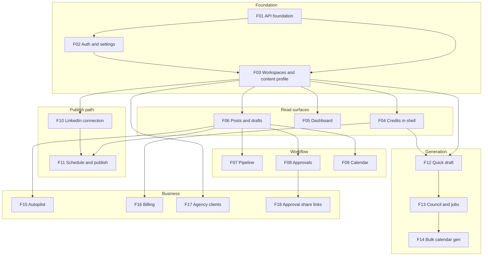

# Frontend Implementation — API Integration & Slice Plan

Living roadmap for wiring `apps/web` to the NestJS API.  
**Backend reference:** [CURRENT_ARCHITECTURE.md](CURRENT_ARCHITECTURE.md) · [PRODUCT_OVERVIEW.md](PRODUCT_OVERVIEW.md) · `SLICE-01`–`SLICE-20` (API specs)  
**Design reference:** `PostPilot AI.dc.html` prototype · existing section components under `apps/web/src/components/sections/app/`

Per-slice specs (when started): `FE-SLICE-NN-*.md` at repo root — same pattern as backend `SLICE-NN-*.md`.

---

## Current state (June 2026)

| Area | Status |
|------|--------|
| Marketing site | Built (landing, pricing, features, auth pages) |
| App shell + sidebar | Built (`/app/*` routes exist) |
| Clerk auth | Sign-in/up wired; `GET/PATCH /auth/me` integrated |
| API integration | **FE-SLICE-01 through FE-SLICE-18 wired** — workspace context, posts, pipeline, approvals, calendar, generation, billing, clients, approval share links |
| Public approval page | `/approve/[token]` — no auth, preview + actions |
| **Remaining mock UI** | Notifications API not built — topbar shows honest empty state |
| **Automated frontend tests** | Vitest unit tests for plan gate, approval-share utils, query errors |

**Integration gap:** Core workflow screens call the API. Polish gaps remain: mock notifications in shell, no E2E/unit tests, plan-gate edge cases on business features.

---

## Conventions (all slices)

### API client

- Base URL: `NEXT_PUBLIC_API_URL` (default `http://localhost:3001/v1`)
- Auth: Clerk `getToken()` → `Authorization: Bearer …` on every request
- Response envelope: `{ data: T }` — parse via `parseApiResponse` in `lib/api/client.ts`
- Errors: `ApiError` with `code` (e.g. `CREDITS_EXHAUSTED`, `RESOURCE_NOT_FOUND`)

### Data fetching

- **TanStack Query** for server state (`AppProviders` already configures `QueryClient`)
- One hook file per domain under `src/hooks/api/` (e.g. `use-posts-api.ts`)
- Centralized keys in `src/lib/api/query-keys.ts` — extend per slice
- Mutations invalidate related query keys on success

### Workspace scoping

- Most routes: `/v1/workspaces/:workspaceId/...`
- Active workspace from `GET /auth/me` → `defaultWorkspaceId`, overridable via workspace switcher
- Agency: `GET /workspaces` lists personal + client workspaces; persist selection in URL (`?workspace=`) or context

### Types

- Mirror backend DTOs in `src/lib/api/types/` (or co-locate with domain `*.ts` files)
- Do not invent frontend-only status values — use `PostPackageStatus` from API

### UI

- Replace `MOCK_*` imports slice-by-slice; delete mock rows when screen is wired
- Reuse existing section components (`Dashboard.tsx`, `Pipeline.tsx`, etc.) — swap data layer only where possible
- Modals already exist: `schedule-modal`, `connect-linkedin-modal`, `request-changes-modal`, `confirm-dialog`

### Env

```env
NEXT_PUBLIC_API_URL=http://localhost:3001/v1
NEXT_PUBLIC_CLERK_PUBLISHABLE_KEY=...
```

---

## Dependency graph

Work top-to-bottom. A slice cannot ship until its dependencies are done.



---

## Progress tracker

Mark `[x]` when slice is shipped (API wired, mocks removed for that screen, basic error/loading states).

### Foundation

- [x] **FE-SLICE-01** — API foundation + workspace context
- [x] **FE-SLICE-02** — Auth, settings, profile photo
- [x] **FE-SLICE-03** — Workspaces + content profile

### Read surfaces

- [x] **FE-SLICE-04** — Credits display (shell)
- [x] **FE-SLICE-05** — Dashboard stats
- [x] **FE-SLICE-06** — Posts list + post package detail

### Workflow

- [x] **FE-SLICE-07** — Pipeline kanban
- [x] **FE-SLICE-08** — Approvals queue
- [x] **FE-SLICE-09** — Calendar views

### Publish path

- [x] **FE-SLICE-10** — LinkedIn connection (real API)
- [x] **FE-SLICE-11** — Schedule, reschedule, publish actions

### Generation

- [x] **FE-SLICE-12** — Quick draft generate
- [x] **FE-SLICE-13** — Council generate + job polling
- [x] **FE-SLICE-14** — Bulk calendar generation job

### Business

- [x] **FE-SLICE-15** — Autopilot config + planned posts
- [x] **FE-SLICE-16** — Billing + Stripe checkout/portal
- [x] **FE-SLICE-17** — Agency client workspaces
- [x] **FE-SLICE-18** — Approval share links

---

## Slice specifications

### FE-SLICE-01 — API foundation + workspace context

**Goal:** Shared infrastructure every other slice uses.

**Depends on:** Clerk auth (existing)

**Backend APIs:** None new — extends client patterns

**Deliverables**

| Item | Detail |
|------|--------|
| `WorkspaceProvider` | Active `workspaceId`, list from `GET /workspaces`, sync with `defaultWorkspaceId` |
| `useApiClient` | Already exists — standardize all hooks on it |
| `query-keys.ts` | Keys for `workspaces`, `workspace(id)`, `credits`, `posts`, etc. |
| `lib/api/types/` | Shared enums (`PostPackageStatus`, `UserPlan`, …) |
| Loading / error UI | Shared `ApiErrorBanner`, query skeleton patterns |
| Workspace switcher | Sidebar header — personal vs client workspaces |

**Pages touched:** `app/app/layout.tsx`, `app-sidebar.tsx`

**Out of scope:** Feature screens, generation

---

### FE-SLICE-02 — Auth, settings, profile photo

**Goal:** Settings page fully backed by API; profile image via R2 presign.

**Depends on:** FE-SLICE-01

**Backend APIs**

| Method | Route |
|--------|-------|
| `GET/PATCH` | `/v1/auth/me` |
| `POST` | `/v1/documents/init` |
| `GET` | `/v1/documents/:id` |

**Deliverables**

- `/app/settings` — timezone, notification toggles, save via `useUpdateCurrentUser`
- Profile photo upload (init → PUT to R2 → attach via `PATCH /auth/me` with `profileDocumentId`)
- Display name / initials from real user (replace hardcoded "Maya")
- Handle `ACCOUNT_DELETED` / auth errors gracefully

**Out of scope:** Billing, LinkedIn

---

### FE-SLICE-03 — Workspaces + content profile

**Goal:** Content profile CRUD at `/app/profile`; workspace awareness for agency.

**Depends on:** FE-SLICE-01, FE-SLICE-02

**Backend APIs**

| Method | Route |
|--------|-------|
| `GET` | `/v1/workspaces`, `/v1/workspaces/current` |
| `GET/POST/PATCH/DELETE` | `/v1/workspaces/:workspaceId/content-profiles` |

**Maps to backend:** SLICE-01

**Deliverables**

- Wire `Profile.tsx` to list/create/edit/delete content profiles
- Pillar editor (replace on save — matches API)
- Default profile selection
- Empty state when no profile exists

**Out of scope:** Client workspace creation (FE-SLICE-17)

---

### FE-SLICE-04 — Credits display (shell)

**Goal:** Global credits meter in app shell; gate generation CTAs when exhausted.

**Depends on:** FE-SLICE-01

**Backend APIs**

| Method | Route |
|--------|-------|
| `GET` | `/v1/credits` |

**Maps to backend:** SLICE-06

**Deliverables**

- Sidebar or header: `used / limit`, plan badge
- Refetch after generation mutations
- `402 CREDITS_EXHAUSTED` → upgrade CTA linking to billing

**Out of scope:** Stripe checkout (FE-SLICE-16)

---

### FE-SLICE-05 — Dashboard

**Goal:** Dashboard metrics and recent drafts from API.

**Depends on:** FE-SLICE-03, FE-SLICE-04

**Backend APIs**

| Method | Route |
|--------|-------|
| `GET` | `/v1/workspaces/:workspaceId/dashboard/stats` |

**Maps to backend:** SLICE-02

**Deliverables**

- Replace `MOCK_METRICS`, `MOCK_DRAFTS` in `Dashboard.tsx`
- Welcome message uses `useCurrentUser` display name
- LinkedIn banner uses FE-SLICE-10 connection state when available
- Quick links to generate / calendar / autopilot (navigation only)

**Out of scope:** Inline generation on dashboard

---

### FE-SLICE-06 — Posts list + post package detail

**Goal:** CRUD for posts; foundation for pipeline, approvals, scheduling.

**Depends on:** FE-SLICE-03

**Backend APIs**

| Method | Route |
|--------|-------|
| `GET/POST` | `/v1/workspaces/:workspaceId/posts` |
| `GET/PATCH/DELETE` | `.../posts/:postId` |
| `GET` | `.../posts/:postId/versions` |
| `POST` | `.../posts/:postId/approve`, `reject`, `request-changes` |

**Maps to backend:** SLICE-02, SLICE-03

**Deliverables**

- Drafts / scheduled list views (or unified posts list with status filter)
- Post detail page `/app/posts/[id]` — hook, body, cta, tags, status, versions
- Create manual draft, edit, soft-delete
- Status badges aligned with `PostPackageStatus`

**Out of scope:** Pipeline kanban layout (FE-SLICE-07), schedule modal (FE-SLICE-11)

---

### FE-SLICE-07 — Pipeline kanban

**Goal:** Kanban board by pipeline column from API.

**Depends on:** FE-SLICE-06

**Backend APIs**

| Method | Route |
|--------|-------|
| `GET` | `/v1/workspaces/:workspaceId/pipeline` |

**Maps to backend:** SLICE-03

**Deliverables**

- Replace `MOCK_PIPELINE` in `Pipeline.tsx`
- Columns match backend pipeline groups
- Card click → post detail
- `hasMore` per column if API returns pagination cursor

**Out of scope:** Drag-and-drop status change (use detail + actions unless API adds PATCH)

---

### FE-SLICE-08 — Approvals queue

**Goal:** In-app approval workflow for `ready_for_approval` posts.

**Depends on:** FE-SLICE-06

**Backend APIs**

| Method | Route |
|--------|-------|
| `GET` | `/v1/workspaces/:workspaceId/approvals` |
| `POST` | `.../posts/:postId/approve`, `reject`, `request-changes` |

**Maps to backend:** SLICE-05

**Deliverables**

- Replace `MOCK_APPROVALS` in `Approvals.tsx`
- Approve / reject / request-changes modals call API
- Optimistic updates or refetch on success

**Out of scope:** Public share links (FE-SLICE-18)

---

### FE-SLICE-09 — Calendar views

**Goal:** Month / week / list calendar from API.

**Depends on:** FE-SLICE-06

**Backend APIs**

| Method | Route |
|--------|-------|
| `GET` | `/v1/workspaces/:workspaceId/calendar?view=&date=&status=&limit=` |

**Maps to backend:** SLICE-04

**Deliverables**

- Replace mock events in `Calendar.tsx`
- Respect user timezone from `auth/me`
- Show published posts via `publishedAt` (backend already supports this)
- Click event → post detail

**Out of scope:** Bulk calendar generation UI (FE-SLICE-14)

---

### FE-SLICE-10 — LinkedIn connection (real API)

**Goal:** Connection status and connect CTA backed by API + Clerk.

**Depends on:** FE-SLICE-01

**Backend APIs**

| Method | Route |
|--------|-------|
| `GET` | `/v1/linkedin/connection` |
| `GET` | `/v1/linkedin/profile` |
| `POST` | `/v1/linkedin/profile/sync` |

**Maps to backend:** SLICE-12

**Deliverables**

- Finish `use-linkedin-api.ts` — connection + publish scope check
- Replace `AppUiProvider` mock LinkedIn state in production path
- Connect modal triggers Clerk OAuth / reauthorize
- Callback handler at `/app/linkedin/callback` refreshes connection query
- Dashboard + settings show real connection status

**Out of scope:** Publish action (FE-SLICE-11)

---

### FE-SLICE-11 — Schedule, reschedule, publish

**Goal:** Schedule modal and publish button on post detail.

**Depends on:** FE-SLICE-06, FE-SLICE-10

**Backend APIs**

| Method | Route |
|--------|-------|
| `POST/PATCH/DELETE` | `.../posts/:id/schedule` |
| `POST` | `.../posts/:id/publish` |

**Maps to backend:** SLICE-11, SLICE-12

**Deliverables**

- Wire `schedule-modal.tsx` to scheduling API (validation: min lead, max days)
- Publish now on approved/scheduled posts
- Handle `409` publish conflicts, `LINKEDIN_NOT_CONNECTED`
- Cancel schedule → refetch post + calendar

**Out of scope:** Failed publish retry UI (show status from API; manual retry button optional P2)

---

### FE-SLICE-12 — Quick draft generate

**Goal:** Generate page produces real variants from API.

**Depends on:** FE-SLICE-03, FE-SLICE-04

**Backend APIs**

| Method | Route |
|--------|-------|
| `POST` | `/v1/workspaces/:workspaceId/generate/quick` |

**Maps to backend:** SLICE-08

**Deliverables**

- Replace `MOCK_GENERATED` in `Generate.tsx`
- Form: topic/context, content profile picker, optional pillar
- Display 3 variants from `job.result.variants`
- Save variant → `POST /posts` (create draft from chosen variant)
- Credit cost display; handle `CREDITS_EXHAUSTED`

**Out of scope:** Council async flow (FE-SLICE-13)

---

### FE-SLICE-13 — Council generate + job polling

**Goal:** AI Council path with live progress timeline.

**Depends on:** FE-SLICE-12

**Backend APIs**

| Method | Route |
|--------|-------|
| `POST` | `.../generate/council` |
| `GET` | `/v1/jobs/:id` |
| `GET` | `.../posts/:postId/council` |

**Maps to backend:** SLICE-09, SLICE-10

**Deliverables**

- Council mode on generate page (or dedicated flow)
- Poll `GET /jobs/:id` every 2–3s while `running`
- Progress bar + `events[]` timeline
- On complete → navigate to post detail (`postPackageId`)
- Error states: `failed`, `REDIS_UNAVAILABLE`

**Out of scope:** Media regen UI (display media from post when present)

---

### FE-SLICE-14 — Bulk calendar generation

**Goal:** Create calendar job from generate/calendar flow.

**Depends on:** FE-SLICE-13 (job polling pattern)

**Backend APIs**

| Method | Route |
|--------|-------|
| `POST` | `.../generate/calendar` |
| `GET` | `/v1/jobs/:id` |

**Maps to backend:** SLICE-14

**Deliverables**

- Calendar generation form: duration (7/30 days), posting time, content profile
- Show credit cost (10/30) before submit
- Job progress UI; on complete refresh calendar + posts lists
- Link from dashboard "Create Calendar" CTA

**Out of scope:** Per-slot editing before approval

---

### FE-SLICE-15 — Autopilot

**Goal:** Autopilot settings and planned posts pages.

**Depends on:** FE-SLICE-03, FE-SLICE-06

**Backend APIs**

| Method | Route |
|--------|-------|
| `GET/PUT` | `.../autopilot` |
| `GET` | `.../autopilot/planned` |

**Maps to backend:** SLICE-15

**Deliverables**

- Replace mocks in `Autopilot.tsx`
- Enable toggle, posting days + time, content profile
- Planned posts list with scheduled dates
- Plan-gate: autopilot requires pro+ (use plan from credits or billing)

**Out of scope:** Cron/tick internals (backend only)

---

### FE-SLICE-16 — Billing

**Goal:** Billing page with plan, usage, Stripe checkout/portal.

**Depends on:** FE-SLICE-04

**Backend APIs**

| Method | Route |
|--------|-------|
| `GET` | `/v1/billing` |
| `POST` | `/v1/billing/checkout`, `/v1/billing/portal` |

**Maps to backend:** SLICE-18

**Deliverables**

- Replace mocks in `Billing.tsx`
- Current plan, renewal date, credit usage summary
- Upgrade → Stripe Checkout redirect; Manage → Customer Portal
- Return URL handling after checkout

**Out of scope:** Webhooks (backend only)

---

### FE-SLICE-17 — Agency client workspaces

**Goal:** Clients page for agency plan — create/switch client workspaces.

**Depends on:** FE-SLICE-01, FE-SLICE-03

**Backend APIs**

| Method | Route |
|--------|-------|
| `POST` | `/v1/workspaces` (type `client`) |
| `GET/PATCH/DELETE` | `/v1/workspaces/:workspaceId` |

**Maps to backend:** SLICE-19

**Deliverables**

- Replace `MOCK_CLIENTS` in `Clients.tsx`
- Create client workspace (name, limit 5)
- Switch active workspace to client context
- Plan-gate: agency plan only

**Out of scope:** Team members / invites (not in API)

---

### FE-SLICE-18 — Approval share links

**Goal:** Create/revoke share links from post detail; optional public approve page.

**Depends on:** FE-SLICE-08

**Backend APIs**

| Method | Route |
|--------|-------|
| `POST` | `.../posts/:postId/approval-link` |
| `GET/DELETE` | `.../approval-link` |
| Public | `GET/POST /v1/public/approval/:token` (+ `/approve`, `/request-changes`, `/reject`) |

**Maps to backend:** SLICE-20

**Deliverables**

- "Share for approval" on ready posts — copy link, expiry display, revoke active link
- Public route `/approve/[token]` (no auth) — preview, approve, reject, request changes
- Plan-gate: `approval_share_links` feature flag from billing

**Out of scope:** Email delivery of links

---

## Slice doc template

When starting a slice, copy to `FE-SLICE-NN-short-name.md`:

```markdown
# FE-Slice NN — Title

**Status:** Not started | In progress | Complete
**Depends on:** FE-SLICE-…

## Goal
…

## Backend APIs
| Method | Route |

## Deliverables
- [ ] …

## Files (expected)
- `src/hooks/api/…`
- `src/components/sections/app/…`

## Test plan
- [ ] …

## Out of scope
…
```

---

## Suggested implementation order (sprints)

| Sprint | Slices | Outcome |
|--------|--------|---------|
| 1 | F01 → F02 → F03 | Workspace context, settings, content profile |
| 2 | F04 → F05 → F06 | Credits, dashboard, posts CRUD |
| 3 | F07 → F08 → F09 | Pipeline, approvals, calendar |
| 4 | F10 → F11 | LinkedIn + schedule/publish |
| 5 | F12 → F13 | Quick draft + council |
| 6 | F14 → F15 | Bulk calendar + autopilot |
| 7 | F16 → F17 → F18 | Billing, agency, share links |

---

## Doc sync (frontend)

When a FE slice ships, update in the **same PR**:

1. This file — progress tracker checkbox
2. `FE-SLICE-NN-*.md` — mark complete
3. [PRODUCT_OVERVIEW.md](PRODUCT_OVERVIEW.md) — frontend screens section
4. [CURRENT_ARCHITECTURE.md](CURRENT_ARCHITECTURE.md) — frontend status paragraph if materially changed

---

## Deferred (not in initial FE slices)

- Drag-and-drop pipeline status changes
- Real-time job updates (WebSockets) — polling is enough for v1
- Offline / optimistic council timeline
- E2E Playwright suite (add after F06+)
- Delete `lib/mock-app-data.ts` only when **all** consumers are wired

---

*Start with **FE-SLICE-01**. Create `FE-SLICE-01-api-foundation.md` when beginning implementation.*
