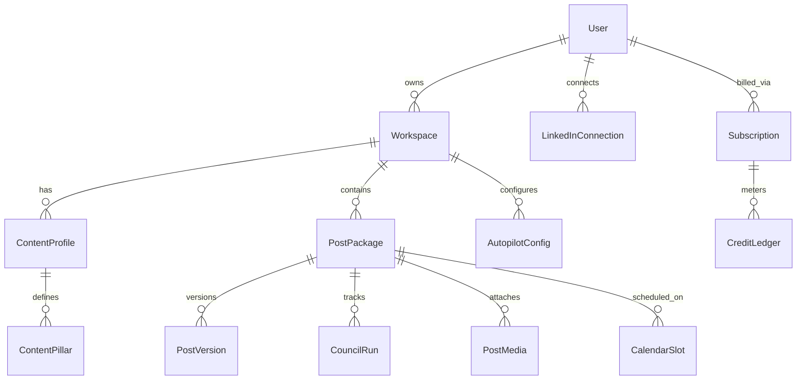
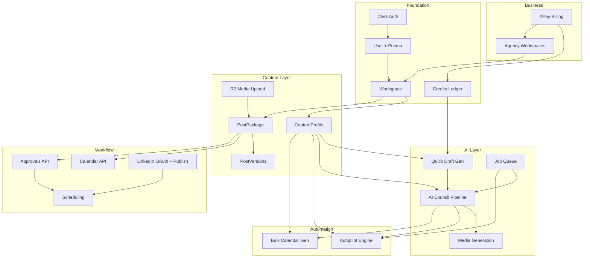

# linkedinpost.ai — Product Overview & Backend Build Map

Living reference doc for the full product. Check items off as we ship them.  
Design source: `PostPilot AI.dc.html` (prototype).  
Codebase: `apps/backend` + `apps/web`.

### Slice docs

Per-slice implementation specs live at the repo root:

- [SLICE-01-auth-settings-content-profile.md](SLICE-01-auth-settings-content-profile.md) — Done
- [SLICE-02-posts-dashboard.md](SLICE-02-posts-dashboard.md) — Done
- [SLICE-03-pipeline-status.md](SLICE-03-pipeline-status.md) — Done
- [SLICE-04-calendar.md](SLICE-04-calendar.md) — Done
- [SLICE-05-approvals.md](SLICE-05-approvals.md) — Done
- [SLICE-06-credits.md](SLICE-06-credits.md) — Done
- [SLICE-07-generation-foundation.md](SLICE-07-generation-foundation.md) — Done
- [SLICE-08-quick-draft-api.md](SLICE-08-quick-draft-api.md) — Done
- [SLICE-09-async-job-queue.md](SLICE-09-async-job-queue.md) — Done
- [SLICE-10-ai-council.md](SLICE-10-ai-council.md) — Done
- [SLICE-11-scheduling-api.md](SLICE-11-scheduling-api.md) — Done
- [SLICE-12-linkedin-publish.md](SLICE-12-linkedin-publish.md) — Done
- [SLICE-13-media-generation.md](SLICE-13-media-generation.md) — Done
- [SLICE-14-bulk-calendar-generation.md](SLICE-14-bulk-calendar-generation.md) — Done
- [SLICE-15-autopilot.md](SLICE-15-autopilot.md) — Done
- [SLICE-16-linkedin-publish-media.md](SLICE-16-linkedin-publish-media.md) — Done
- [SLICE-17-nano-banana-image-generation.md](SLICE-17-nano-banana-image-generation.md) — Done
- [SLICE-18-stripe-billing.md](SLICE-18-stripe-billing.md) — Done (XPay; filename historical)
- [SLICE-19-agency-client-workspaces.md](SLICE-19-agency-client-workspaces.md) — Done
- [SLICE-20-approval-share-links.md](SLICE-20-approval-share-links.md) — Done
- [SLICE-22-topic-suggestions.md](SLICE-22-topic-suggestions.md) — Done
- [SLICE-23-ai-content-profiles.md](SLICE-23-ai-content-profiles.md) — Done

---

## Progress tracker

Update this section as features land. Tell the agent to mark items `[x]` when done.

### Foundation

- [x] Clerk auth (sign-in, JWT guard, webhooks, `/auth/me`)
- [x] Prisma `User` + `Document` models
- [x] R2 presigned document upload
- [x] Personal `Workspace` auto-created on signup
- [x] Plan field on user (credits ledger still stub)
- [x] Account settings (`PATCH /auth/me` extended)
- [x] Unit test suite + [TESTING.md](apps/backend/TESTING.md)

### Phase 1 — Data foundation

- [x] Prisma: `Workspace`, `ContentProfile`, `ContentPillar`
- [x] Prisma: `PostPackage`, `PostVersion`
- [x] API: workspaces
- [x] API: content-profiles CRUD
- [x] API: posts / drafts CRUD
- [x] API: `GET /dashboard/stats`

### Phase 2 — Workflow (no AI)

- [x] API: calendar (month / week / list)
- [x] API: pipeline kanban by status
- [x] API: approvals queue (manual status changes)
- [x] Credits check middleware

### Phase 3 — Generation

- [x] `POST /generate/quick` (LLM → 3 variants)
- [x] Generation module foundation (context, prompts, mock LLM, parser)
- [x] Job queue + `GET /jobs/:id` (sync quick draft + async council via BullMQ)
- [x] Async job queue — BullMQ + Redis ([SLICE-09](SLICE-09-async-job-queue.md))
- [x] AI Council pipeline v1 + timeline events ([SLICE-10](SLICE-10-ai-council.md))
- [x] Credit deduct on generation
- [x] Topic suggestions magic button — `POST /generate/suggest-topics` ([SLICE-22](SLICE-22-topic-suggestions.md))
- [x] AI content profile suggestions — suggest free, 1 credit per approve ([SLICE-23](SLICE-23-ai-content-profiles.md))

### Phase 4 — LinkedIn publish

- [x] Schedule post API (semantic endpoints) — [SLICE-11](SLICE-11-scheduling-api.md)
- [x] LinkedIn OAuth via Clerk + publish scope — [SLICE-12](SLICE-12-linkedin-publish.md)
- [x] Publish now + scheduled publish job — [SLICE-12](SLICE-12-linkedin-publish.md)
- [x] Failed / retry publish states — [SLICE-12](SLICE-12-linkedin-publish.md)
- [x] LinkedIn profile sync — OIDC (name, email, photo); optional current role via identityMe — [SLICE-12](SLICE-12-linkedin-publish.md)
- [x] Settings: timezone (existing `PATCH /auth/me`)

### Phase 5 — Autopilot & media

- [x] Media generation (Slice 13)
- [x] Bulk calendar (Slice 14)
- [x] `AutopilotConfig` + cron engine (Slice 15)
- [x] Media generation + attach to post — [SLICE-13](SLICE-13-media-generation.md)
- [x] Bulk calendar generation job — [SLICE-14](SLICE-14-bulk-calendar-generation.md)
- [x] Real image generation (Nano Banana 2) — [SLICE-17](SLICE-17-nano-banana-image-generation.md)

### Phase 6 — Business

- [x] XPay subscriptions + webhooks — [SLICE-18](SLICE-18-stripe-billing.md)
- [x] Agency client workspaces — [SLICE-19](SLICE-19-agency-client-workspaces.md)
- [x] Approval share links for clients — [SLICE-20](SLICE-20-approval-share-links.md)

### Frontend screens (track separately)

See [FRONTEND_IMPLEMENTATION.md](FRONTEND_IMPLEMENTATION.md) for slice order and dependencies (`FE-SLICE-01`–`20`).

- [x] Marketing pages (static)
- [x] App shell + sidebar (UI only)
- [x] Auth pages (Clerk)
- [x] API foundation + workspace context (FE-SLICE-01)
- [x] Settings + profile photo (FE-SLICE-02)
- [x] Content profile (FE-SLICE-03)
- [x] Credits in shell (FE-SLICE-04)
- [x] Dashboard — API wired (FE-SLICE-05)
- [x] Posts + post detail (FE-SLICE-06)
- [x] Generate — quick draft (FE-SLICE-12)
- [x] Generate — council + jobs (FE-SLICE-13)
- [x] Calendar — API wired (FE-SLICE-09)
- [x] Pipeline — API wired (FE-SLICE-07)
- [x] Approvals — API wired (FE-SLICE-08)
- [x] Schedule + publish (FE-SLICE-11)
- [x] LinkedIn connection (FE-SLICE-10)
- [x] Autopilot — API wired (FE-SLICE-15)
- [x] Bulk calendar gen (FE-SLICE-14)
- [x] Clients / agency (FE-SLICE-17)
- [x] Billing — API wired (FE-SLICE-16)
- [x] Approval share links (FE-SLICE-18)
- [x] Notifications topbar + push (FE-SLICE-19)
- [x] Notifications inbox + polish (FE-SLICE-20)

---

## 1. Product summary

**linkedinpost.ai** is an AI LinkedIn content engine for founders, creators, consultants, and agencies.

Core promise: generate authentic LinkedIn posts, plan a content calendar, run an **AI Content Council** (writer → reviewer → editor → media), require human approval, then schedule or publish to LinkedIn.

**Pricing tiers (from design):**

| Plan | Price | Credits/mo | Highlights |
|------|-------|------------|------------|
| Free | $0 | 5 | Basic generator, 1 content profile, copy posts |
| Starter | $9 | 50 | Drafts, templates, 1 LinkedIn profile |
| Pro | $19 | 200 | 30-day calendar, tone presets, rewrite, scheduling, Autopilot |
| Agency | $49 | 1,000 | 5 client workspaces, multi-profile, higher limits |

**Credit costs (from design):** Quick Draft 1 · AI Council 3 · Post+Media 10 · Regenerate Media 5 · Revision 1–2 · 7-day Calendar 10 · 30-day Calendar 30 · Autopilot package 10

---

## 2. Screen inventory (what the UI expects)

### Marketing (mostly static — low backend)

- Landing, Features, How it Works, Pricing, About, Privacy, Terms, Contact
- Auth: sign-in / sign-up (Clerk — started)

### App shell (shared layout)

- Sidebar nav: Dashboard, Generate, Autopilot, Pipeline, Calendar, Approvals, Clients, Profile, Billing, Settings
- Workspace switcher (personal vs agency clients)
- Notifications dropdown (topbar) + full inbox at `/app/notifications` (via **View all**)
- Global search (“Search posts, drafts…”)
- Credits meter in sidebar

### Core app screens

| Screen | Purpose | Key backend needs |
|--------|---------|-------------------|
| **Dashboard** | Metrics, recent drafts, calendar snippet, quick actions | Aggregations, recent posts |
| **Generate** | Post generator form + 3 AI options output | AI jobs, credits, content profile |
| **Calendar** | Week / month / list views, filters | Calendar entries, statuses |
| **Drafts** | List/filter drafts, copy, schedule, delete | Post CRUD |
| **Scheduled** | Upcoming/published/failed posts | Scheduling + publish jobs |
| **Profile** | Content profile (voice, pillars, sample, avoid-words) | ContentProfile CRUD |
| **Autopilot** | Frequency, strategy, approval mode, planned posts | Cron jobs, strategy config, AI pipeline |
| **Pipeline** | Kanban by production stage | PostPackage status machine |
| **Approvals** | Review queue: mine / client / changes / approved | Approval workflow |
| **Post Package** | Full detail: brief, preview, media, AI scores, council timeline, versions | Rich post model + agent run history |
| **Clients** | Agency client workspaces | Workspace multi-tenancy |
| **Billing** | Plan, credits, usage breakdown, history | XPay + credit ledger |
| **Settings** | Account, LinkedIn connection, publishing defaults, notifications | OAuth tokens, user prefs |
| **Notifications** | Full inbox, unread filter, mark read | User-scoped notification API |

### Modals / flows (cross-cutting)

- LinkedIn Connect OAuth
- Upgrade modal (out of credits)
- Request Changes on a post package
- Approve & Schedule / Approve & Post Now
- Generate Calendar (bulk)

---

## 3. Core domain concepts (backend mental model)

### PostPackage (central entity)

Unit that moves through the pipeline.

**Stages:** Brief Created → Text Generating → Text Reviewing → Media Generating → Ready for Approval → Approved → Scheduled → Publishing → Published | Failed

**Fields:** hook, body, cta, tags, topic, postType, tone, pillar, goal, optional media custom prompt, score (0–100), source (Manual / Calendar / Autopilot), workspace, scheduledAt

**Child data:** versions, council agent timeline, media assets, approval state

### ContentProfile (voice engine input)

- name, role, industry, audience, goal, preferred tone
- offer/product description
- content pillars
- writing sample
- words/phrases to avoid

### Workspace

- Personal workspace (default per user)
- Agency: up to 5 client workspaces, each with own profile + posts

---

## 4. Backend modules to build

| Module | Responsibility | Status |
|--------|----------------|--------|
| **auth** | Clerk JWT, webhooks, `/auth/me` | Done |
| **users** | User sync, basic profile | Done |
| **documents** | R2 presigned uploads | Done |
| **workspaces** | Personal + client workspace CRUD | Done (Slice 19) |
| **content-profiles** | Voice profile CRUD + pillars | Done |
| **posts** | PostPackage CRUD, versions, status | Done (draft CRUD, status transitions, pipeline) |
| **generation** | AI jobs (quick / council / media) | Quick draft + council API |
| **job-queue** | BullMQ + Redis worker ([SLICE-09](SLICE-09-async-job-queue.md)) | Done |
| **council** | Multi-agent orchestration, scores, timeline ([SLICE-10](SLICE-10-ai-council.md)) | Done |
| **media** | Image/carousel generation + review | Not started |
| **calendar** | Calendar views, bulk calendar gen | Month/week/list API done |
| **approvals** | Approval queue, request changes | Queue + actions done |
| **scheduling** | Schedule posts, timezone | Done ([SLICE-11](SLICE-11-scheduling-api.md)) |
| **linkedin** | OAuth connect, publish API, profile sync | Done ([SLICE-12](SLICE-12-linkedin-publish.md)) |
| **autopilot** | Config + cron generation + approval mode + day profiles | Done ([SLICE-15](SLICE-15-autopilot.md), [SLICE-21](SLICE-21-autopilot-v2.md)) |
| **credits** | Ledger, deduct, monthly reset | Ledger stub + guard done |
| **billing** | XPay subscriptions | Complete (Slice 18) |
| **notifications** | In-app + email + web push | Done (Slice 21) |
| **dashboard** | Read-only aggregations | Done |
| **search** | Full-text search posts/drafts | Not started |

---

## 5. Difficulty rating (backend-only)

**Easy** = CRUD + auth guard  
**Medium** = workflows, aggregations, one external integration  
**Hard** = AI orchestration, async pipelines, billing, LinkedIn API

| Feature | Difficulty | Notes |
|---------|------------|-------|
| User auth (Clerk) | **Done** | |
| Document/media upload (R2) | **Done** | Extend for post media later |
| `/auth/me` + account settings | **Easy** | |
| Notification preferences | **Easy** | |
| Content Profile CRUD | **Easy** | |
| Workspaces (personal only) | **Easy** | |
| Drafts list / CRUD | **Easy** | |
| Dashboard metrics | **Easy** | |
| Calendar CRUD (manual) | **Medium** | |
| Pipeline kanban API | **Medium** | |
| Approvals queue API | **Medium** | |
| Post versions history | **Medium** | |
| Credits ledger (basic) | **Medium** | |
| Search posts | **Medium** | |
| Quick Draft generation | **Medium** | |
| AI Council pipeline | **Hard** | |
| Media generation + review | **Hard** | |
| Autopilot cron engine | **Hard** | |
| Bulk calendar generation | **Hard** | |
| LinkedIn OAuth + publish | **Hard** | |
| XPay billing + webhooks | **Hard** | |
| Agency multi-workspace | **Medium–Hard** | |
| Approval share links | **Medium** | |
| Real-time generation progress | **Medium–Hard** | |

### Easiest backend wins first (no AI, no LinkedIn)

1. Content Profile API
2. PostPackage CRUD + Drafts
3. Workspace scaffold (single personal workspace)
4. Credits service stub (hardcoded plan limits)
5. Dashboard aggregations
6. Calendar list endpoints (manual entries)

---

## 6. Feature dependency list

`A → B` means **build A before B**.

### Foundation

- `Clerk auth` → everything authenticated
- `Prisma + User` → all domain models
- `Workspace` → all content is workspace-scoped
- `Plan + credits ledger` → any limited AI action

### Content & posts

- `ContentProfile` → `Generate`, `Autopilot strategy`
- `PostPackage` → `Drafts`, `Scheduled`, `Pipeline`, `Approvals`, `Post detail`
- `PostPackage.status` → `Pipeline kanban`, `Approvals tabs`
- `PostVersion` → `Post detail / version history`
- `Document/R2 upload` → `Post media`, `Profile avatar`

### AI

- `ContentProfile` → `Quick Draft`
- `Quick Draft` → `AI Council`
- `Credits middleware` → all generation endpoints
- `Job queue` → `Council`, `Media`, `Bulk calendar`, `Autopilot`
- `CouncilRun + events` → `Post detail timeline + scores`
- `Media generation` → `Post+Media`, `Autopilot packages`

### Workflow

- `PostPackage` → `Calendar`, `Approvals`
- `Approvals` → `Scheduling`
- `Scheduling` → `Scheduled list`
- `LinkedIn OAuth` → `Publish now`, `Auto-publish`
- `LinkedIn connection` → `Schedule from draft` (UI gates on this)

### Automation

- `ContentProfile + AutopilotConfig` → `Autopilot`
- `Autopilot` → `Pipeline (source=Autopilot)`, `Approvals auto-fill`
- `Bulk calendar gen` → AI-populated calendar

### Business

- `Workspace (multi)` → `Clients screen`
- `XPay` → `Plan enforcement`, `Billing`
- `Plan tier` → workspace limits, credit limits, feature flags
- `Agency plan` → client workspaces (max 5)

---

## 7. Dependency diagram

---

## 8. API phases (reference — we go smaller step-by-step)

| Phase | Scope | Difficulty |
|-------|-------|------------|
| 0 | Clerk auth, R2 uploads, health | Done |
| 1 | Workspace, ContentProfile, PostPackage, dashboard stats | Easy |
| 2 | Calendar, pipeline, approvals (no AI) | Easy–Medium |
| 3 | Quick draft, AI Council, job queue | Medium–Hard |
| 4 | LinkedIn OAuth, schedule, publish | Hard |
| 5 | Autopilot, media gen, bulk calendar | Hard |
| 6 | XPay, agency workspaces, approval links | Hard |

We will **not** tackle whole phases at once — pick one small feature per step.

---

## 9. Prisma models to add (future)

Beyond current `User` / `Document`:

- `Workspace`, `WorkspaceMember`
- `ContentProfile`, `ContentPillar`
- `PostPackage`, `PostVersion`, `PostMedia`
- `CouncilRun`, `CouncilEvent`
- `CalendarEntry` (or `scheduledAt` on PostPackage)
- `AutopilotConfig`
- `LinkedInConnection`
- `CreditTransaction`, `Subscription`
- `Notification`
- `ApprovalToken` (optional)

---

## 10. API routes

**Exists today**

- `GET /v1/health`
- `GET/PATCH /v1/auth/me`
- `POST /v1/auth/logout`
- `POST /v1/auth/webhooks/clerk`
- `POST /v1/documents/init`
- `GET /v1/documents/:id`
- `GET /v1/workspaces`, `GET /v1/workspaces/current`
- CRUD `/v1/workspaces/:workspaceId/content-profiles`
- CRUD `/v1/workspaces/:workspaceId/posts`, `GET .../posts/:id/versions`, `PATCH .../posts/:id/status`
- `GET /v1/workspaces/:workspaceId/pipeline`
- `GET /v1/workspaces/:workspaceId/calendar`
- `GET /v1/workspaces/:workspaceId/approvals`
- `POST /v1/workspaces/:workspaceId/posts/:id/approve`, `.../request-changes`, `.../reject`
- `GET /v1/credits`
- `GET /v1/workspaces/:workspaceId/dashboard/stats`

**To add (grouped)**

- `/workspaces/:id/switch`
- `/posts/:id/approve`, `/reject`, `/request-changes`
- `/posts/:id/schedule`, `/publish`
- `/generate/quick`, `/generate/council`, `/generate/calendar`
- `/jobs/:id`
- `/calendar`, `/approvals`
- `/autopilot`
- `/linkedin/connect`, `/callback`, `/disconnect`
- `/billing`, `/billing/cancel`, `/billing/webhooks/xpay`
- `/credits`, `/search`

---

## 11. Deferred (not building yet)

- Full onboarding wizard
- Apple sign-in
- Auto-approve by score threshold (COMING SOON in design)
- Marketing CMS backend (keep static)

---

## 12. Suggested first small slice

When ready to build the next backend feature:

1. `Workspace` model + auto-create on signup
2. `ContentProfile` CRUD
3. `PostPackage` draft CRUD
4. `GET /dashboard/stats`

This unblocks Profile, Drafts, and Dashboard UI without AI or LinkedIn.

---

*Last updated: product overview created from PostPilot AI design prototype.*
