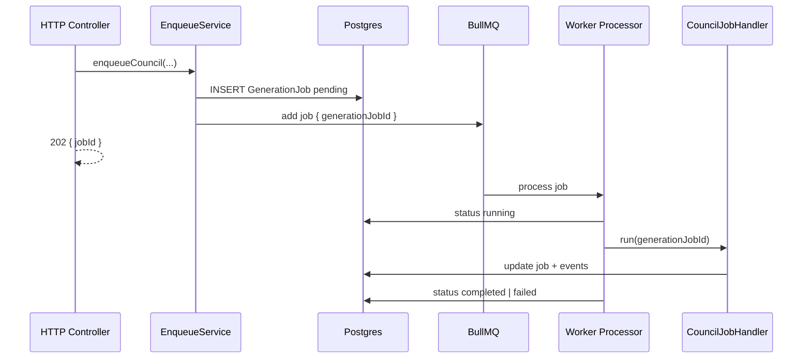

# Slice 09 — Async Job Queue (BullMQ + Redis)

**Status:** Complete  
**Phase:** Phase 3 — Generation (infrastructure)  
**Difficulty:** Medium

## Goal

Add Redis-backed async job processing so long-running generation flows (AI Council first, then media / bulk calendar / Autopilot later) do not block HTTP requests. Quick Draft **stays synchronous** in Slice 08 style; Council (Slice 10) is the first consumer.

## Why a separate slice

AI Council is already **Hard** (5 agents, revision loops, timeline, PostPackage output). BullMQ wiring, worker lifecycle, and failure/retry semantics are reusable infrastructure worth landing and testing on their own before the orchestrator.

## Dependencies

- Slice 08: `GenerationJob` model, `GET /v1/jobs/:id`, credits on success
- Local or hosted Redis instance

## Deliverables

| Item | Description |
|------|-------------|
| Redis config | `REDIS_URL` via `@nestjs/config` |
| BullMQ module | `@nestjs/bullmq` + `bullmq` + `ioredis` |
| Queue | `generation-jobs` (single queue v1; split later if needed) |
| Processor | `GenerationJobProcessor` — dispatches by `GenerationJobType` |
| Enqueue API | Internal service: create `GenerationJob` row → add Bull job |
| Worker | Runs inside Nest app (`OnModuleInit`) or `npm run start:worker` script |
| Job polling | Extend `GET /jobs/:id` with optional `progress` block |
| Docs | Env example, `GENERATION.md` queue section |

## Env

```env
REDIS_URL=redis://localhost:6379
# Optional
GENERATION_QUEUE_CONCURRENCY=2
```

Without `REDIS_URL`, council endpoint (Slice 10) should fail fast with clear error — do **not** silently fall back to in-process sync for council (too long for HTTP).

## Module layout

```
apps/backend/src/modules/job-queue/
├── job-queue.module.ts
├── job-queue.config.ts
├── generation-job.queue.ts          # register queue + inject token
├── generation-job.processor.ts      # @Processor('generation-jobs')
├── generation-job-enqueue.service.ts
└── job-handler.registry.ts          # type → handler map
```

Handlers are registered by type:

```typescript
// Slice 10 adds: GenerationJobType.council → CouncilJobHandler
```

## Flow



## Prisma changes (minimal)

Extend `GenerationJob` for live progress (council and future async jobs):

```prisma
model GenerationJob {
  // ... existing fields ...
  postPackageId   String?   @db.Uuid
  councilRunId    String?   @db.Uuid
  currentStep     String?   // e.g. "reviewer"
  progress        Json?     // { currentLabel, completedSteps, totalSteps, percentComplete }

  postPackage PostPackage? @relation(...)
  councilRun  CouncilRun?  @relation(...)
}
```

`CouncilRun` / `CouncilEvent` models ship in **Slice 10**; migration can be one file if both slices land together, or Slice 09 adds nullable FK columns only.

### `progress` JSON shape (stable contract for frontend)

```typescript
interface GenerationJobProgress {
  currentStep: string;       // agent role or internal step id
  currentLabel: string;      // "Reviewer scoring draft"
  completedSteps: number;
  totalSteps: number;        // dynamic when revision loop may run
  percentComplete: number;   // 0–100, best-effort
}
```

## API changes

### `GET /v1/jobs/:id` (extend existing)

Add to response when present:

```json
{
  "progress": {
    "currentStep": "editor",
    "currentLabel": "Editor polishing copy",
    "completedSteps": 5,
    "totalSteps": 7,
    "percentComplete": 71
  },
  "postPackageId": null,
  "councilRunId": "uuid-or-null"
}
```

Council-specific `events[]` are added in Slice 10 (either nested here or via dedicated route).

### HTTP status for async jobs

| Job type | POST response |
|----------|---------------|
| `quick_draft` | `200` + completed job (unchanged) |
| `council` | `202 Accepted` + `{ jobId, status: "pending" }` |

## Worker behavior

| Concern | Decision |
|---------|----------|
| Concurrency | Default `2` per worker process (env override) |
| Retries | BullMQ: `3` attempts, exponential backoff (1s, 4s, 16s) |
| Idempotency | Handler checks job status; skip if already `completed` |
| Stale `running` | On worker crash, Bull retries; handler may resume or fail with `JOB_STALE` |
| Credit charge | **Still on success only** — handler calls `CreditsService.consume()` |
| Job failure | Set `GenerationJob.status = failed`, `errorCode`, `errorMessage` |

## Open questions (resolved for v1)

| Question | Decision |
|----------|----------|
| Separate worker process? | **Optional v1** — same Nest app is fine for dev; document `start:worker` for prod |
| Multiple queues? | **Single queue** v1; split `council` / `media` later |
| Quick draft async? | **No** — keep sync until UX needs it |
| SSE / WebSockets? | **Out of scope** — polling `GET /jobs/:id` every 2–3s |

## Progress checklist

- [x] Add `@nestjs/bullmq`, `bullmq`, `ioredis`
- [x] `REDIS_URL` config + validation
- [x] `JobQueueModule` + queue registration
- [x] `GenerationJobEnqueueService`
- [x] `GenerationJobProcessor` + handler registry
- [x] Extend `GenerationJob` + migration (`progress`, FK placeholders)
- [x] Extend `GenerationJobResponseDto` + mapper
- [x] Unit tests: enqueue, processor dispatch, idempotency, failure path
- [x] Update `GENERATION.md`, `.env.example`, PRODUCT_OVERVIEW

## Out of scope

- AI Council orchestration (Slice 10)
- `CouncilRun` / `CouncilEvent` tables (Slice 10)
- `POST /generate/council` (Slice 10)
- SSE streaming
- Horizontal scaling / multiple worker pods (document only)

## Test plan

```bash
cd apps/backend && npm test && npm run build

# Manual (with Redis)
redis-server
REDIS_URL=redis://localhost:6379 npm run start:dev

# Enqueue stub job via internal test or Slice 10 council POST
GET /v1/jobs/{jobId}   # poll until completed | failed
```

## Next

→ [SLICE-10-ai-council.md](SLICE-10-ai-council.md)
