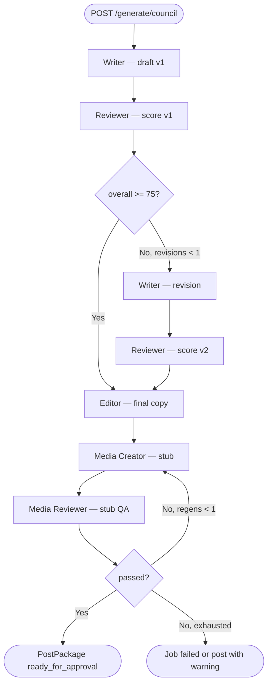

# Slice 10 — AI Council Pipeline v1

**Status:** Complete  
**Phase:** Phase 3 — Generation  
**Difficulty:** Hard

## Goal

Multi-agent **AI Content Council** in one orchestrated run: Writer → Reviewer → (optional revision) → Editor → Media Creator → Media Reviewer. Persist a **timeline** of every step, create a **`PostPackage`** on success, charge **3 credits** on success, and expose **live progress** via job polling.

## Dependencies

- Slice 07: `ContextAssembler`, `PromptRenderer`, `ModelRouter`, parsers pattern
- Slice 08: `GenerationJob`, credits, OpenAI provider
- **Slice 09:** BullMQ + Redis async queue (required for council)

## Slice split summary

| Slice | Scope |
|-------|--------|
| **09** | Redis, BullMQ, enqueue, worker, job `progress` fields |
| **10** | Council models, orchestrator, 5 agents, API, timeline, PostPackage |

---

## Product decisions (locked for v1)

| Topic | Decision |
|-------|----------|
| Agents | All **5** in one run: writer, reviewer, editor, media_creator, media_reviewer |
| Output | Create **`PostPackage`** + `PostVersion` v1 + scores on post |
| Job vs post | `GenerationJob` tracks run; `CouncilRun` + `CouncilEvent` = audit timeline |
| Async | `POST /generate/council` → **202** + `jobId`; worker executes |
| Live UX | Poll `GET /jobs/:id` (2–3s); `events[]` grows as steps complete |
| History UX | `GET /posts/:postId/council` — all runs for post detail screen |
| Revision loop | **Yes** — if reviewer score &lt; threshold, writer revises once, reviewer re-scores |
| Max text revisions | **1** (2 writer passes max, 2 reviewer passes max) |
| Editor timing | After text revision loop settles |
| Media steps | **Stubbed** v1 (placeholder asset metadata, no real image gen) |
| Media revision | **Max 1** regen when media reviewer fails (stub logic only until Phase 5) |
| Credits | Flat **3** per council run (`CreditTransactionType.council`), success only |
| Quick draft | Unchanged (sync, 1 credit, no PostPackage) |
| Realtime push | **Polling only** v1; SSE in a future slice |
| Score threshold | **75** overall (constant `COUNCIL_PASS_SCORE`, env override optional) |

### Open questions (deferred)

| Question | Default / note |
|----------|----------------|
| Sub-scores weights | Store raw reviewer JSON; UI shows hook/voice/clarity if model returns them |
| Partial failure after post created | v1: rollback post on failure **before** editor completes; after editor, mark post `failed` if media step dies |
| Re-run council on existing post | **Out of scope** v1 (future: `POST /posts/:id/regenerate-council`) |
| Auto-approve by score | Product says COMING SOON — not in v1 |

---

## Pipeline



### Post status transitions during run

| Step | `PostPackage.status` |
|------|----------------------|
| Job accepted | `text_generating` |
| Reviewer running | `text_reviewing` |
| Media creator running | `media_generating` |
| Success | `ready_for_approval` |
| Failure | `failed` (or revert to `draft` if post not yet materialized — pick one: **`failed`** for traceability) |

Create post early (after job enqueue) with `hook` placeholder from input topic, or create after editor — **recommendation: create after Writer v1** with draft hook/body so UI can deep-link during run.

**v1 choice:** Create `PostPackage` at **start** with `status: text_generating`, `source: generation`, topic from input; update fields as pipeline progresses.

---

## Prisma

### New enums

```prisma
enum CouncilAgentRole {
  writer
  reviewer
  editor
  media_creator
  media_reviewer
}

enum CouncilEventStatus {
  running
  completed
  failed
  skipped
}

enum CouncilRunStatus {
  pending
  running
  completed
  failed
}
```

### Extend existing

```prisma
enum GenerationJobType {
  quick_draft
  council
}
```

### `CouncilRun`

```prisma
model CouncilRun {
  id              String           @id @default(uuid()) @db.Uuid
  workspaceId     String           @db.Uuid
  generationJobId String           @unique @db.Uuid
  postPackageId   String           @db.Uuid
  status          CouncilRunStatus @default(pending)
  revisionCount   Int              @default(0)
  mediaRegenCount Int              @default(0)
  finalScore      Int?
  createdAt       DateTime         @default(now()) @db.Timestamptz(6)
  completedAt     DateTime?        @db.Timestamptz(6)

  generationJob GenerationJob @relation(...)
  postPackage   PostPackage   @relation(...)
  events        CouncilEvent[]

  @@index([postPackageId])
  @@map("council_runs")
}
```

### `CouncilEvent` (append-only timeline)

```prisma
model CouncilEvent {
  id              String             @id @default(uuid()) @db.Uuid
  councilRunId    String             @db.Uuid
  agentRole       CouncilAgentRole
  stepOrder       Int                // monotonic per run
  revisionAttempt Int                @default(1)  // writer/reviewer pass
  status          CouncilEventStatus
  label           String             // UI string
  output          Json?              // agent-specific payload
  scores          Json?              // reviewer scores
  model           String?
  inputTokens     Int?
  outputTokens    Int?
  errorCode       String?
  errorMessage    String?
  startedAt       DateTime           @default(now()) @db.Timestamptz(6)
  completedAt     DateTime?          @db.Timestamptz(6)
  durationMs      Int?

  councilRun CouncilRun @relation(...)

  @@index([councilRunId, stepOrder])
  @@map("council_events")
}
```

### `PostPackage` relation

```prisma
model PostPackage {
  // ... existing ...
  councilRuns CouncilRun[]
}
```

Migration: `20250629100000_add_council_pipeline` (name TBD).

---

## Module layout

```
apps/backend/src/modules/council/
├── council.module.ts
├── council.types.ts
├── council.errors.ts
├── council-orchestrator.ts          # main state machine
├── council-job.service.ts           # enqueue + handler entry
├── council-job.handler.ts             # implements JobHandler for queue
├── council-event.service.ts           # append/update events + progress
├── council-progress.ts                # percentComplete calculator
├── parsers/
│   ├── writer-output.parser.ts
│   ├── reviewer-output.parser.ts
│   ├── editor-output.parser.ts
│   ├── media-creator-output.parser.ts
│   └── media-reviewer-output.parser.ts
├── prompts/
│   ├── council-writer.v1.system.ts
│   ├── council-writer.v1.user.ts
│   ├── council-reviewer.v1.system.ts
│   ├── ... (one pair per agent)
│   └── prompt-registry extension
├── agents/
│   ├── council-writer.agent.ts
│   ├── council-reviewer.agent.ts
│   ├── council-editor.agent.ts
│   ├── council-media-creator.agent.ts   # stub
│   └── council-media-reviewer.agent.ts  # stub
└── council.controller.ts              # POST generate/council (or under generation/)

apps/backend/src/modules/generation/
├── context/context-assembler.ts         # extend: priorSteps[]
├── prompt-renderer.ts                   # council template vars
└── generation.controller.ts             # add council route OR delegate
```

`council` is its own Nest module; imports `GenerationModule`, `JobQueueModule`, `PostsModule` (or uses Prisma directly for post updates).

---

## Context & prompts

### Extend `GenerationContext`

```typescript
interface CouncilPriorStep {
  agentRole: CouncilAgentRole;
  revisionAttempt: number;
  output: Record<string, unknown>;
  scores?: Record<string, number>;
}

interface GenerationContext {
  // ... existing ...
  priorSteps?: CouncilPriorStep[];
}
```

Each agent after Writer receives `priorSteps` so Reviewer sees draft, Editor sees draft + feedback + scores, etc.

### Prompt registry entries

| `flowId` | Agents | `promptVersion` |
|----------|--------|-----------------|
| `council-writer` | writer | v1 |
| `council-reviewer` | reviewer | v1 |
| `council-editor` | editor | v1 |
| `council-media-creator` | media_creator | v1 |
| `council-media-reviewer` | media_reviewer | v1 |

### Expected parser outputs (JSON)

**Writer**

```json
{ "hook": "...", "body": "...", "cta": "...", "tags": ["..."], "rationale": "..." }
```

**Reviewer**

```json
{
  "overall": 72,
  "hook": 80,
  "voice": 65,
  "clarity": 70,
  "passed": false,
  "feedback": "Tone drifts in paragraph 2",
  "revisionHints": ["Shorten hook", "Match writing sample cadence"]
}
```

**Editor**

```json
{ "hook": "...", "body": "...", "cta": "...", "tags": ["..."], "changelog": "..." }
```

**Media Creator (stub)**

```json
{
  "mediaType": "quote_card",
  "placeholderUrl": null,
  "altText": "Quote card for hook",
  "status": "stub_pending_phase5"
}
```

**Media Reviewer (stub)**

```json
{ "passed": true, "issues": [], "score": 85 }
```

---

## Orchestrator pseudocode

```typescript
async run(councilRunId: string) {
  const run = await loadRun(councilRunId);
  let revisionCount = 0;
  let mediaRegenCount = 0;
  let draft = await stepWriter(run, revisionAttempt: 1);

  let review = await stepReviewer(run, draft, revisionAttempt: 1);
  while (!review.passed && revisionCount < MAX_TEXT_REVISIONS) {
    revisionCount++;
    draft = await stepWriter(run, revisionAttempt: revisionCount + 1, feedback: review);
    review = await stepReviewer(run, draft, revisionAttempt: revisionCount + 1);
  }
  if (!review.passed) {
    // v1: continue anyway with warning in event output, or fail — **continue to editor** with low score flagged
  }

  const final = await stepEditor(run, draft, review);
  await updatePostFromEditor(run.postPackageId, final, review.overall);

  let media = await stepMediaCreator(run, final);
  let mediaReview = await stepMediaReviewer(run, media);
  while (!mediaReview.passed && mediaRegenCount < MAX_MEDIA_REGENS) {
    mediaRegenCount++;
    media = await stepMediaCreator(run, final, feedback: mediaReview);
    mediaReview = await stepMediaReviewer(run, media);
  }

  await finalizeRun(run, review.overall, mediaReview);
}
```

**Low score after max revisions:** Proceed to Editor but set `PostPackage.score` from last review and add event note `"proceeded_below_threshold"`.

### Per-step side effects

1. Insert `CouncilEvent` `running`
2. Update `GenerationJob.progress`
3. Update `PostPackage.status` when step category changes
4. Call LLM (or stub)
5. Update event `completed` + tokens + duration
6. Push output into `priorSteps` in memory

---

## API

### `POST /v1/workspaces/:workspaceId/generate/council`

Guards: `ClerkAuthGuard`, `CreditsGuard`  
Decorator: `@CreditsCost(3)` — guard checks balance; charge on success in handler.

**Request** (mirrors quick draft + optional brief):

```json
{
  "topic": "Why founders should ship weekly",
  "postType": "personal_story",
  "tone": "Bold",
  "pillar": "Founder lessons",
  "contentProfileId": "optional-uuid",
  "additionalContext": "optional",
  "brief": "optional longer brief"
}
```

**Response:** `202 Accepted`

```json
{
  "data": {
    "id": "job-uuid",
    "type": "council",
    "status": "pending",
    "creditCost": 3,
    "councilRunId": "uuid",
    "postPackageId": "uuid"
  }
}
```

### `GET /v1/jobs/:id` (extended)

For `type: council`, include:

```json
{
  "progress": { "currentStep": "reviewer", "currentLabel": "...", "completedSteps": 2, "totalSteps": 7, "percentComplete": 29 },
  "councilRunId": "uuid",
  "postPackageId": "uuid",
  "events": [
    {
      "id": "uuid",
      "agentRole": "writer",
      "stepOrder": 1,
      "revisionAttempt": 1,
      "status": "completed",
      "label": "Writer created draft v1",
      "scores": null,
      "output": { "hook": "..." },
      "startedAt": "...",
      "completedAt": "...",
      "durationMs": 4200
    }
  ],
  "result": null
}
```

On `completed`:

```json
{
  "status": "completed",
  "result": {
    "postPackageId": "uuid",
    "finalScore": 81,
    "revisionCount": 1,
    "mediaRegenCount": 0
  }
}
```

### `GET /v1/workspaces/:workspaceId/posts/:postId/council`

Returns council history for Post Package detail UI.

```json
{
  "data": {
    "postPackageId": "uuid",
    "runs": [
      {
        "id": "council-run-uuid",
        "generationJobId": "uuid",
        "status": "completed",
        "finalScore": 81,
        "revisionCount": 1,
        "createdAt": "...",
        "completedAt": "...",
        "events": [ /* same shape as job events */ ]
      }
    ]
  }
}
```

---

## Live progress & timeline (frontend contract)

### While generating

1. `POST /generate/council` → store `jobId`, `postPackageId`
2. Navigate to Post Package or generation progress view
3. Poll `GET /jobs/:jobId` every **2–3 seconds**
4. Render `events[]` as vertical timeline (append-only)
5. Show `progress.currentLabel` as active step spinner
6. Stop polling when `status` is `completed` or `failed`

### Example timeline (UI)

```
● Writer          — Draft v1 created           4.2s
● Reviewer        — Score 68 — needs revision  3.1s
● Writer          — Revision applied           5.0s
● Reviewer        — Score 81 — approved        2.8s
● Editor          — Final copy ready           6.1s
● Media Creator   — Quote card (stub)          0.1s
● Media Reviewer  — QA passed                  0.1s
```

### Post detail (after completion)

Use `GET .../posts/:id/council` for full history; show `PostPackage.score` from last reviewer overall (or media-weighted later).

---

## Credits

| Event | Behavior |
|-------|----------|
| Guard on POST | Require balance ≥ 3 |
| Charge | `CreditsService.consume(userId, 3, council, jobId)` on successful completion |
| Failure | No charge |
| Revision loops | No extra credit (internal token cost absorbed) |

---

## Errors

| Code | When |
|------|------|
| `COUNCIL_CONTEXT_ERROR` | Missing content profile / invalid workspace |
| `COUNCIL_PARSE_ERROR` | Agent JSON invalid |
| `COUNCIL_AGENT_FAILED` | LLM error mid-pipeline |
| `COUNCIL_MEDIA_STUB_FAILED` | Stub media reviewer simulated failure after max regens |
| `REDIS_UNAVAILABLE` | No `REDIS_URL` when enqueueing |

Failed jobs: last `CouncilEvent` has `status: failed`; `GenerationJob.errorMessage` summarizes step.

---

## Env

```env
REDIS_URL=redis://localhost:6379
OPENAI_API_KEY=sk-...
OPENAI_TEXT_MODEL=gpt-5.4
COUNCIL_PASS_SCORE=75
COUNCIL_MAX_TEXT_REVISIONS=1
COUNCIL_MAX_MEDIA_REGENS=1
```

---

## Testing strategy

| Layer | Focus |
|-------|--------|
| Parsers | Valid/invalid JSON per agent |
| Agents | Mock `ModelRouter`, assert rendered prompts include `priorSteps` |
| Orchestrator | Revision loop, max revision cap, status transitions (unit, no Redis) |
| CouncilJobHandler | Integration with mocked queue |
| Controllers | 202 response, auth, credits guard |
| E2E (optional) | Redis testcontainer + full run with mock LLM |

Target: keep **96+** existing tests green; add ~15–25 new specs.

```bash
cd apps/backend && npm test && npm run build
```

Manual:

```bash
redis-server
POST /v1/workspaces/{wsId}/generate/council
GET  /v1/jobs/{jobId}              # poll
GET  /v1/workspaces/{wsId}/posts/{postId}/council
GET  /v1/credits                   # -3 on success
```

---

## Implementation order

1. Prisma: enums, `CouncilRun`, `CouncilEvent`, `GenerationJobType.council`, relations
2. Council types, errors, event service, progress calculator
3. Prompts + parsers + agent classes (writer, reviewer, editor first)
4. `CouncilOrchestrator` with revision loop (unit tested)
5. Stub media agents
6. `CouncilJobHandler` + wire to Slice 09 processor
7. `CouncilJobService` + `POST /generate/council` (202)
8. Extend `GET /jobs/:id` with `events` + council fields
9. `GET /posts/:postId/council`
10. Swagger DTOs, `GENERATION.md`, `COUNCIL.md`, PRODUCT_OVERVIEW checkbox

---

## Progress checklist

- [x] Prisma migration (`CouncilRun`, `CouncilEvent`, job type `council`)
- [x] `priorSteps` in context assembler
- [x] 5 prompt templates + registry
- [x] 5 output parsers
- [x] 5 agent runners (3 LLM + 2 stub)
- [x] `CouncilOrchestrator` + revision loops
- [x] Post create/update + status transitions
- [x] `CouncilJobHandler` + enqueue (Slice 09)
- [x] `POST /generate/council` (202, 3 credits)
- [x] `GET /jobs/:id` timeline payload
- [x] `GET /posts/:postId/council`
- [x] Unit + integration tests
- [x] Docs + PRODUCT_OVERVIEW

---

## Out of scope (v1)

- Real Nano Banana 2 / Imagen 4 image generation (Phase 5)
- Vision model for media reviewer
- SSE / WebSocket live stream
- Frontend Post Package UI (tracked separately)
- Re-run council on existing post
- Auto-approve by score threshold
- Unlimited revision loops
- Separate credits per revision
- `PostMedia` table + R2 upload (stub JSON only)

---

## Future slices (reference)

| Slice | Scope |
|-------|--------|
| 11 | SSE `GET /jobs/:id/stream` for push progress |
| Phase 5 | Real media generation + `PostMedia` + regen credits |
| — | `POST /posts/:id/regenerate-council` |
