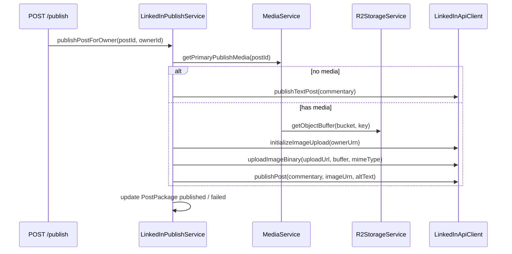

# Slice 16 — LinkedIn publish with PostMedia

**Status:** Complete  
**Phase:** Post–Phase 5 polish (closes the generate → approve → publish loop)

## One slice, one outcome

> **When a post has council-generated `PostMedia`, publish (now or scheduled) uploads the image to LinkedIn and creates a feed post with that image attached. Text-only posts keep the existing behavior.**

No new HTTP routes. Same `POST /v1/workspaces/:workspaceId/posts/:id/publish` and the existing `publish-jobs` BullMQ worker.

---

## Where you are

| Done | Relevant to this slice |
|------|------------------------|
| Slice 12 | `LinkedInPublishService`, `publishTextPost`, Clerk OAuth, scheduled publish |
| Slice 13 | `PostMedia` in R2, `MediaService.listForPost`, council attaches `quote_card` PNG |
| Slice 15 | Autopilot council posts include media |
| **Missing** | Read media from R2 → LinkedIn 3-step image upload → post with `content.media` |

---

## Flow



Scheduled posts use the same path via `PublishJobProcessor` → `publishPostForOwner` — no separate worker changes beyond tests.

---

## LinkedIn API (3-step image attach)

Uses existing `w_member_social` scope (no new OAuth scopes).

| Step | Request | Notes |
|------|---------|-------|
| 1 | `POST /rest/images?action=initializeUpload` | Body: `{ initializeUploadRequest: { owner: "urn:li:person:{memberId}" } }` |
| 2 | `PUT {uploadUrl}` | Raw image bytes; **no** `Authorization` header; `Content-Type` = mime |
| 3 | `POST /rest/posts` | Add `content.media: { id: imageUrn, altText }` alongside existing fields |

Headers on LinkedIn REST calls (unchanged from Slice 12):

- `Authorization: Bearer {token}`
- `LinkedIn-Version: {YYYYMM}` (from config)
- `X-Restli-Protocol-Version: 2.0.0`

**v1 media rule:** publish the **first** `PostMedia` row for the post (`sortOrder` asc). Council/autopilot only create one `quote_card` today.

**Text-only fallback:** if `post_media` count is 0, call existing `publishTextPost` unchanged.

---

## Code changes

### New / extended files

| File | Change |
|------|--------|
| `storage/r2-storage.service.ts` | Add `getObjectBuffer(bucket, key): Promise<Buffer>` |
| `media/media.service.ts` | Add `getPrimaryPublishMedia(postPackageId)` → `{ buffer, mimeType, altText } \| null` |
| `linkedin/linkedin-api.client.ts` | `initializeImageUpload`, `uploadImageBinary`, refactor `publishPost` with optional media |
| `linkedin/linkedin.services.ts` | Branch in `publishPostForOwner` based on media presence |
| `linkedin/linkedin.types.ts` | Types for upload init response |
| `config/linkedin.config.ts` | Optional `imagesInitializeUrl` override for tests |

### `LinkedInApiClient` surface

```typescript
async initializeImageUpload(input: {
  accessToken: string;
  ownerUrn: string;
}): Promise<{ uploadUrl: string; imageUrn: string }>;

async uploadImageBinary(input: {
  uploadUrl: string;
  buffer: Buffer;
  mimeType: string;
}): Promise<void>;

async publishPost(input: {
  accessToken: string;
  memberId: string;
  commentary: string;
  media?: { imageUrn: string; altText: string };
}): Promise<LinkedInPublishResult>;
```

Keep `publishTextPost` as a thin wrapper calling `publishPost` without media (or inline — minimal diff).

### Mock mode (`LINKEDIN_PUBLISH_MOCK=true`)

Simulate all three steps without network:

- `initializeImageUpload` → fake `uploadUrl` + `urn:li:image:mock-{ts}`
- `uploadImageBinary` → no-op
- `publishPost` with media → same mock share URN as text today

Enables unit tests without LinkedIn credentials.

### Module wiring

- `LinkedInModule` imports `MediaModule` (export `MediaService` from `MediaModule` if not already)
- `LinkedInPublishService` injects `MediaService`

**No Prisma migration** — reuse existing `PostMedia` + publish fields on `PostPackage`.

**No new credit charges** — publish is free (same as Slice 12).

---

## Error handling

| Case | Behavior |
|------|----------|
| No `PostMedia` | Text-only publish (unchanged) |
| R2 read fails | `failed` status + `publishErrorCode: LINKEDIN_MEDIA_READ_FAILED` |
| Image init/upload fails | `failed` + `LINKEDIN_IMAGE_UPLOAD_FAILED` |
| Post create fails after upload | `failed` + existing `LINKEDIN_PUBLISH_FAILED` |
| Unsupported mime (not `image/png`) | Skip media, log warn, fall back to text-only **or** fail with `LINKEDIN_MEDIA_UNSUPPORTED` — **recommend fail** so user knows image was dropped intentionally |
| Mock mode | Always succeeds |

Recommendation for v1: **only `image/png`** is supported (matches `POST_MEDIA_MIME_TYPES`). Fail publish if media exists but mime is unsupported — avoids silent image loss.

---

## API

No route changes.

| Method | Route | Change |
|--------|-------|--------|
| `POST` | `/v1/workspaces/:workspaceId/posts/:id/publish` | Attaches image when `media[]` exists on post |

Response shape unchanged (`PostPackageResponse`).

---

## Tests

| File | Cases |
|------|-------|
| `r2-storage.service.spec.ts` (or media) | `getObjectBuffer` returns bytes |
| `media.service.spec.ts` | `getPrimaryPublishMedia` picks first row, reads R2 |
| `linkedin-api.client.spec.ts` | mock 3-step flow; post body includes `content.media` when media set |
| `linkedin.services.spec.ts` | with media → image upload called; without → text only |
| `publish-job.processor.spec.ts` (optional) | scheduled publish still delegates to publish service |

```bash
cd apps/backend && npm test && npm run build
```

---

## Docs

- This file (`SLICE-16-linkedin-publish-media.md`) — mark Complete when done
- Update `SLICE-13-media-generation.md` out-of-scope: strike “LinkedIn publish with images”
- Note in `SLICE-12-linkedin-publish.md` that image attach landed in Slice 16
- `PRODUCT_OVERVIEW.md` — add Slice 16 to slice docs list + optional checklist item under Phase 4/5 bridge

---

## Out of scope (other slices)

| Item | Notes |
|------|-------|
| Multiple images / carousel | v1 = first media only |
| Video upload | LinkedIn 4-step video flow |
| `POST /posts/:id/regenerate-media` | Separate slice |
| Real Google image provider | Separate slice (was “Slice 14” in SLICE-13 doc) |
| Company page (`w_organization_social`) | Personal profile only |
| Frontend publish UI changes | Separate track |
| `media[]` on list/calendar/pipeline | Separate slice |
| Caching LinkedIn image URNs on `PostMedia` | Not needed for v1 |

---

## Implementation order

1. `R2StorageService.getObjectBuffer`
2. `MediaService.getPrimaryPublishMedia`
3. `LinkedInApiClient` image upload + unified `publishPost`
4. `LinkedInPublishService` media branch + `MediaModule` import
5. Tests + docs

---

## Progress

- [x] `R2StorageService.getObjectBuffer`
- [x] `MediaService.getPrimaryPublishMedia`
- [x] `LinkedInApiClient` image upload + unified `publishPost`
- [x] `LinkedInPublishService` media branch + `MediaModule` import
- [x] Unit tests + docs

## Done checklist

- [x] Post with `PostMedia` publishes to LinkedIn with image attached
- [x] Post without media still publishes text-only
- [x] Scheduled publish (`publish-jobs`) uses same media path
- [x] Mock mode covers image flow in tests
- [x] Tests pass; `nest build` succeeds

---

## Manual test plan (with real LinkedIn)

1. Run council on a post → confirm `GET .../posts/:id` has `media[0].url`
2. Approve + `POST .../publish` with `LINKEDIN_PUBLISH_MOCK=false`
3. Verify LinkedIn feed shows image + commentary
4. Repeat with a manual text-only post (no media) — text still works
